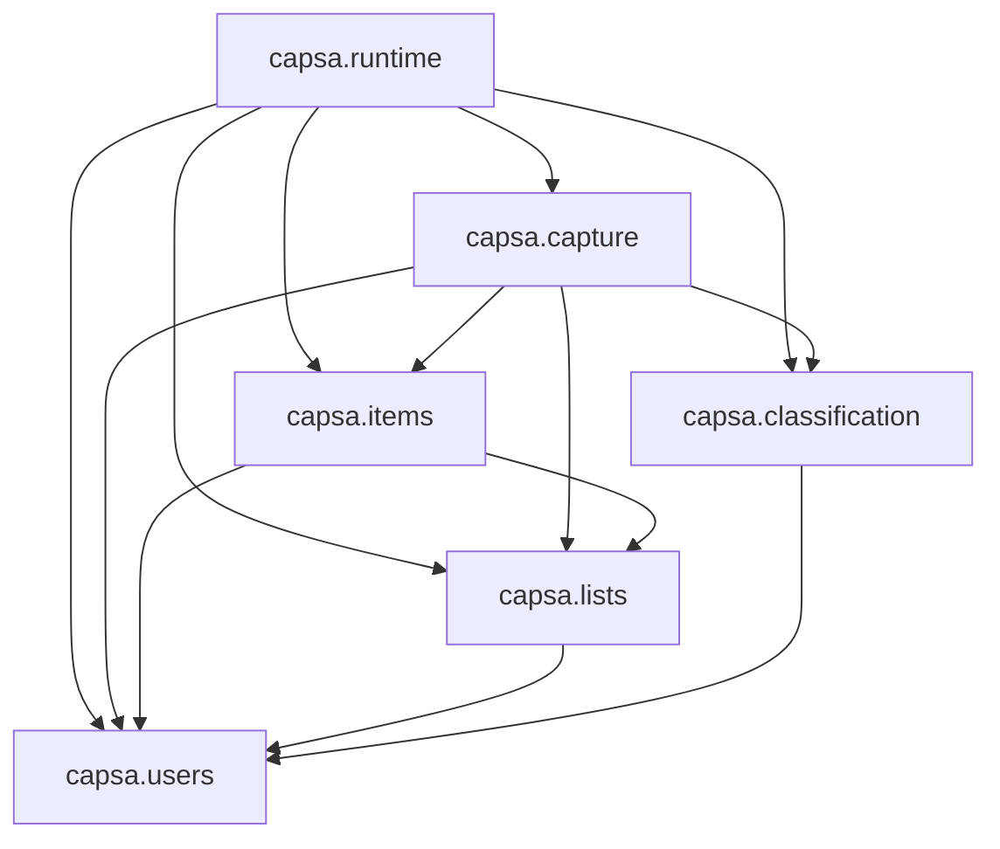

# CAPSA-ARCH-001 — Capsa Modular Monolith Architecture v0.1

**Task:** CAPSA-ARCH-001
**Input authority:** reconciled domain model (CAPSA-DOMAIN-RECONCILE-001), UC-01 through UC-06, product intent
**Review:** CAPSA-ARCH-REVIEW-001 — REVISE resolved by CAPSA-ARCH-RECONCILE-001
**Status:** Reconciled — ready for Engineering Plan

---

## 1. Architecture Overview

Capsa's server is a **Java 25 / Quarkus modular monolith organized by business capability**. Each capability owns its domain objects, persistence, and public service interface. JPMS module boundaries enforce that no capability accesses another capability's internal implementation.

The organizing question is not "which layer does this belong to?" but "which capability owns this behavior?"

**Why a modular monolith and not microservices:**
v0.1 serves a single real user. Microservices would add operational complexity — independent deployments, network calls, distributed transactions — with no current justification. The modular monolith preserves meaningful architectural discipline (capability isolation, dependency direction, public-surface contracts) while remaining deployable as a single artifact.

**Why capability-organized rather than horizontal layers:**
Horizontal layers (`domain`, `application`, `infrastructure`) cut across capabilities, creating cross-cutting concerns for every change. Capability modules let a single business change (e.g., item completion) stay within one module. Horizontal concerns such as persistence technology and CDI wiring are internal implementation choices, not module boundaries.

**Core rules:**
1. A capability is the only writer and reader of its own persistence tables.
2. Cross-capability collaboration occurs through the other capability's public service, never its repository.
3. JPMS module exports are the enforced contract; what is not exported does not exist to other modules.
4. Quarkus-specific composition belongs in `runtime`; capabilities use Jakarta standards.
5. Public capability APIs express business capabilities, not internal architectural patterns.

---

## 2. Repository Layout

```
capsa/
├── server/
│   ├── pom.xml                         parent POM, Maven multi-module
│   ├── capsa-users/
│   ├── capsa-lists/
│   ├── capsa-items/
│   ├── capsa-capture/
│   ├── capsa-classification/
│   └── capsa-runtime/                  produces the Quarkus executable
├── clients/
│   ├── android/
│   ├── ios/
│   └── desktop/                        future / optional
├── deployment/
└── docs/
```

`server/` is a Maven multi-module project. `capsa-runtime` is the only module with `<packaging>quarkus</packaging>` and the Quarkus Maven plugin. All other modules are plain `jar` modules.

Each Maven module is one JPMS module.

---

## 3. Capability Model

### `capsa.users`

**Responsibility:** owns the Capsa User identity. Receives OIDC-provisioned identities and maintains the application-level User record. Does not own authentication credentials. Publishes the `CurrentUser` interface so capability REST resources can obtain the authenticated User's identity without depending on `runtime`.

**Concepts/entities owned:** `User`, `UserId`, `CurrentUser`

**Public types:**
- `UserId` — typed identifier; `public record UserId(UUID value) {}`. Not reducible to raw UUID; it is a semantic concept that crosses module boundaries.
- `CurrentUser` — interface for the request-scoped authenticated user abstraction:
  ```java
  // capsa.users.api
  public interface CurrentUser {
      UserId userId();
  }
  ```
  `runtime` provides the concrete OIDC implementation. Capability REST resources inject `CurrentUser` without depending on `runtime`.

**Public operations:**
- `findOrProvision(oidcSubject, email, name)` → `UserView` — finds or creates a User from a verified OIDC identity; called once per request by the runtime auth filter
- `findById(userId)` → `Optional<UserView>` — looks up a User by identity

**Internal services:** `UserService`

**Repositories owned:** `UserRepository` → `users` table

**External adapters:** none

**Dependencies on other capabilities:** none

**Allowed dependents:** `runtime` (OIDC provisioning and `CurrentUser` implementation); `lists`, `items`, `capture`, `classification` (for `UserId` and `CurrentUser` types)

---

### `capsa.lists`

**Responsibility:** owns Lists and their semantic descriptions. Enforces List invariants (name non-blank, explicit purpose ≠ inferred purpose). Authorizes List access for other capabilities.

**Concepts/entities owned:** `List`, `ListId`

**Public operations:**
- `create(UserId, name, purpose)` → `ListView` — UC-01
- `getById(ListId)` → `Optional<ListView>` — verifies existence; used by items and capture
- `getByUser(UserId)` → `List<ListView>` — used by capture to build classification candidates
- `verifyContributionAccess(UserId, ListId)` — returns void or throws; enforces ownership in v0.1

**Internal services:** `ListService`

**Repositories owned:** `ListRepository` → `lists` table

**External adapters:** none

**Dependencies on other capabilities:** `users` (for `UserId` and `CurrentUser`)

**Allowed dependents:** `items`, `capture`, `runtime`

---

### `capsa.items`

**Responsibility:** owns Item lifecycle. Creates Item occurrences (direct add), completes them, and provides list-filtered views. Enforces Item invariants and access authorization before mutating state. Enforces that an Item occurrence identified by `captureId` is unique (persistence constraint).

**Concepts/entities owned:** `Item`, `ItemId`

**Public operations:**
- `create(UserId, ListId, name, notes)` → `ItemView` — UC-02; verifies list access via lists capability
- `createFromCapture(UserId, ListId, CaptureId, name, notes)` → `ItemView` — UC-03/UC-04; as above; enforces UNIQUE `captureId` at persistence
- `complete(UserId, ItemId)` → `ItemView` — UC-06; verifies user access
- `getByList(UserId, ListId, statusFilter)` → `List<ItemView>` — UC-05; verifies list access

**Internal services:** `ItemService`

**Repositories owned:** `ItemRepository` → `items` table (with UNIQUE constraint on `capture_id` where non-null)

**External adapters:** none

**Dependencies on other capabilities:** `lists` (to verify list existence and contribution access), `users` (for `UserId` and `CurrentUser`)

**Allowed dependents:** `capture`, `runtime`

---

### `capsa.capture`

**Responsibility:** orchestrates the smart-capture flow. Owns Capture evidence, CaptureNormalizer (domain service), CaptureInterpreter (port), and ClassificationAttempt lifecycle. Coordinates classification and item creation without owning either. Manages the two-transaction UC-03 flow (see §12).

**Concepts/entities owned:** `Capture`, `CaptureId`, `ClassificationAttempt`, `ClassificationResolution`

**Public operations:**
- `submit(UserId, content)` → `CaptureResult` — UC-03; returns either a created Item (classified) or candidates + captureId (NEEDS_RESOLUTION)
- `resolve(UserId, CaptureId, ListId)` → `ItemView` — UC-04; records user resolution, creates item, contributes evidence to classification memory

**Internal services:**
- `CaptureOrchestrator` — orchestrates the UC-03 two-transaction flow (not `@Transactional` itself)
- `CaptureCreationService` — `@Transactional`; persists the Capture + initial ClassificationAttempt
- `CaptureResolutionService` — `@Transactional`; persists resolution + creates Item + records evidence

**Internal ports:**
- `CaptureInterpreter` — interprets normalized content into `ItemDraft` (name, notes); may use AI/NLP; implemented by an adapter in this module

**Internal domain service:**
- `CaptureNormalizer` — deterministic mechanical normalization (trim, case, Unicode, punctuation); owned by domain, not a replaceable port; stability is a correctness requirement for Known Classification

**Repositories owned:** `CaptureRepository` → `captures` table; `ClassificationAttemptRepository` → `classification_attempts` table

**External adapters:** `CaptureInterpreterAdapter` (LangChain4j or similar, internal)

**Dependencies on other capabilities:** `classification` (run pipeline, record user resolution), `items` (create item), `lists` (fetch candidate lists for classification), `users` (for `UserId`, `CurrentUser`)

**Allowed dependents:** `runtime`

---

### `capsa.classification`

**Responsibility:** classifies normalized text against candidate Lists. Owns the pipeline, all strategy adapters, and Classification Memory evidence. No knowledge of Captures or Items. Exposes a single `Classifier` interface; all internal implementation detail (pipeline, strategies, memory queries) is private.

**Concepts/entities owned:** `ClassificationMemoryEntry`

**Public API:**
- `Classifier` — the single public interface for classification:
  ```java
  // capsa.classification.api
  public interface Classifier {
      ClassificationResult classify(ClassificationRequest request);
      void recordUserResolution(UserId userId, String normalizedContent, UUID selectedListId);
  }
  ```
- `ClassificationRequest` — input: `UserId`, `normalizedContent`, `List<ClassificationTarget>`
- `ClassificationResult` — outcome (`CLASSIFIED` | `NEEDS_RESOLUTION`), candidates, metadata
- `ClassificationCandidate` — `listId` (UUID), `confidence`, `explanation`
- `ClassificationTarget` — `listId` (UUID), `name`, `explicitPurpose` (local type; no `lists` dependency)

**Internal implementation** (all unexported):
- `DefaultClassifier` — implements `Classifier`; owns the pipeline internally
- `ClassificationPipeline` — executes ordered strategies; private to this capability
- `ClassificationStrategy` — internal SPI; not exported; not visible to other modules
- `KnownClassificationStrategy`, `EmbeddingClassificationStrategy`, `SystemOneClassificationStrategy` — private implementations

The pipeline composes itself. Consumers depend only on `Classifier`. The internal strategy graph may change without requiring consumer recompilation as long as the `Classifier` interface is unchanged.

**Dependencies on other capabilities:** `users` (for `UserId` in `ClassificationRequest`)

**Allowed dependents:** `capture`, `runtime`

---

### `capsa.runtime`

**Responsibility:** the application composition root. Assembles all capabilities, provides the Quarkus bootstrap, CDI producers, OIDC integration, `OidcCurrentUser` implementation, Flyway migrations, and the executable artifact. Contains no business logic.

**Public operations:** none (not a reusable library)

**Contains:**
- Quarkus bootstrap and configuration
- `OidcCurrentUser` — implements `CurrentUser` from `capsa.users.api`:
  ```java
  // capsa.runtime — implements the interface from users.api
  @RequestScoped
  class OidcCurrentUser implements CurrentUser {
      @Inject JsonWebToken jwt;       // Quarkus OIDC — stays in runtime
      @Inject UserService userService;

      private UserId resolvedUserId;

      @PostConstruct
      void resolve() {
          String oidcSubject = jwt.getSubject();
          String email = jwt.getClaim("email");
          String name  = jwt.getClaim("name");
          this.resolvedUserId = userService.findOrProvision(oidcSubject, email, name).userId();
      }

      @Override
      public UserId userId() { return resolvedUserId; }
  }
  ```
  CDI makes `OidcCurrentUser` injectable as `CurrentUser` everywhere. The Quarkus/OIDC types are confined to `runtime`; capability resources only see `CurrentUser`.
- Quarkus extension configuration (quarkus-oidc, quarkus-hibernate-orm, quarkus-flyway, quarkus-cache, etc.)
- Provider configuration: ONNX model path, Jev/DeepSeek endpoint configuration, API keys (from environment/secrets — never committed to source)
- Per-capability exception mappers (translates capability exceptions to JSON error responses)
- Flyway migration coordination
- Quarkus cache configuration
- Any cross-capability configuration concern

**Runtime does not:**
- Name or instantiate private types from capability `internal` packages
- Control strategy ordering through code (ordering is internal to `capsa.classification`)
- Provide configuration values that belong to domain invariants

**Flyway migrations** live in `src/main/resources/db/migration/`, named `V{n}__{capability}_{description}.sql` (e.g., `V001__users_initial.sql`). See §7 for ownership nuance.

**Dependencies on other capabilities:** all (`users`, `lists`, `items`, `capture`, `classification`)

**Allowed dependents:** none (runtime is the leaf)

---

## 4. Module Dependency Graph



**All dependencies are acyclic.** The `users` edges (`lists → users`, `items → users`, `capture → users`, `classification → users`) are justified by the `UserId` type and the `CurrentUser` interface being the public semantic identity abstraction. They do not introduce cycles.

### Dependency Justification

| Edge | Reason |
|---|---|
| `lists → users` | `UserId` in service signatures; `CurrentUser` injected by `ListResource` |
| `items → users` | `UserId` in service signatures; `CurrentUser` injected by `ItemResource` |
| `capture → users` | `UserId` in service signatures; `CurrentUser` injected by `CaptureResource` |
| `classification → users` | `UserId` in `ClassificationRequest` (User-scoped memory lookups) |
| `items → lists` | `verifyContributionAccess` before UC-02, UC-06 mutations |
| `capture → lists` | Fetch candidate lists for UC-03 pipeline |
| `capture → items` | Create Item after successful classification (UC-03/UC-04) |
| `capture → classification` | Run pipeline (UC-03); record evidence (UC-04) |
| `runtime → all` | Composition root: wires all capabilities, provides OIDC implementation |

### Prohibited Dependencies

| Module | Must NOT depend on |
|---|---|
| `users` | any other capability |
| `lists` | `items`, `capture`, `classification`, `runtime` |
| `classification` | `lists`, `items`, `capture`, `runtime` |
| `items` | `capture`, `classification`, `runtime` |
| `capture` | `runtime` |
| any capability | another capability's `internal` package |

### Cross-Module Collaboration Semantics

| Caller | Called | Reason |
|---|---|---|
| `capture` → `lists` | `ListService.getByUser()` | Fetch candidate lists for classification |
| `capture` → `lists` | `ListService.verifyContributionAccess()` | Verify access before UC-04 resolution |
| `capture` → `classification` | `Classifier.classify()` | UC-03 pipeline execution |
| `capture` → `classification` | `Classifier.recordUserResolution()` | UC-04 memory evidence |
| `capture` → `items` | `ItemService.createFromCapture()` | Create item after classified capture; enforces captureId uniqueness |
| `items` → `lists` | `ListService.verifyContributionAccess()` | UC-02 and UC-06 access verification |
| `runtime` → `users` | `UserService.findOrProvision()` | OIDC identity → Capsa User (once per request) |

---

## 5. Public Surface Model

Each JPMS module exports only its `api` package. All `internal` packages are unexported.

### `capsa.users` exports `com.capsa.users.api`

```
UserId                — typed identifier; public record UserId(UUID value) {}
CurrentUser           — interface; request-scoped authenticated user abstraction
UserService           — findOrProvision, findById
UserView              — read model
```

`UserId` and `CurrentUser` are the primary cross-module types consumed by capability modules.

### `capsa.lists` exports `com.capsa.lists.api`

```
ListService           — create(UserId, name, purpose), getById(ListId), getByUser(UserId), verifyContributionAccess(UserId, ListId)
ListId                — typed identifier
ListView              — read model (id, name, purpose, ownerId as UserId)
CreateListCommand     — input model
```

### `capsa.items` exports `com.capsa.items.api`

```
ItemService           — create, createFromCapture, complete, getByList
ItemId                — typed identifier
ItemView              — read model (id, listId, captureId, name, status, createdAt, completedAt)
CreateItemCommand     — input model
ItemStatusFilter      — ACTIVE | HISTORY | ALL (for UC-05 views)
```

`CaptureId` in `ItemView.captureId` is represented as `UUID` (capture does not export `CaptureId` to items; the nullable UUID reference is sufficient for traceability).

### `capsa.capture` exports `com.capsa.capture.api`

```
CaptureService        — submit(UserId, content), resolve(UserId, CaptureId, ListId)
CaptureId             — typed identifier
CaptureResult         — discriminated union: Classified(itemView) | NeedsResolution(captureId, candidates)
SubmitCaptureCommand  — input model
```

### `capsa.classification` exports `com.capsa.classification.api`

```
Classifier            — classify(ClassificationRequest), recordUserResolution(UserId, normalizedContent, UUID selectedListId)
ClassificationRequest — UserId, normalizedContent (String), candidates (List<ClassificationTarget>)
ClassificationResult  — outcome(CLASSIFIED|NEEDS_RESOLUTION), candidates, metadata
ClassificationCandidate — listId (UUID), confidence, explanation
ClassificationTarget  — listId (UUID), name, explicitPurpose (local type; no lists dependency)
```

`ClassificationStrategy`, `ClassificationPipeline`, `DefaultClassifier`, and all concrete strategy implementations are **not exported** and do not exist to any module outside `capsa.classification`.

### `capsa.runtime`

Exports nothing. Produces the Quarkus executable. Depends on all of the above.

---

## 6. Capability Internal Structure

Every capability follows the same anatomy. Internal packages are never exported.

```
com.capsa.{capability}/
├── api/                        exported
│   ├── {Service}               public service interface (or Classifier for classification)
│   ├── {Entity}Id              typed identifier
│   ├── {Entity}View            outbound read model
│   └── {Command|Result}        inbound/outbound data types
│
└── internal/                   never exported
    ├── domain/
    │   ├── {Entity}            domain object (not a JPA entity)
    │   └── {ValueObject}       domain value
    ├── service/
    │   └── {Service}Impl       implements the api service or interface
    ├── persistence/
    │   ├── entity/
    │   │   └── {Entity}Entity  JPA entity (@Entity, @Table)
    │   ├── repository/
    │   │   └── {Entity}Repository  EntityManager-based repository
    │   └── converter/
    │       └── {Entity}Converter   domain ↔ JPA entity conversion
    └── rest/
        └── {Entity}Resource    Jakarta REST resource (@Path, @GET, etc.)
```

**Conventions:**
- Domain objects have no JPA annotations, no JSON-B annotations, no CDI annotations.
- JPA entities have no business logic; they are persistence representations only.
- Converters are pure functions: `toDomain(entity)` and `toEntity(domain)`.
- REST resources are thin: validate input, resolve current user via `CurrentUser`, delegate to service, map result to response.
- Services own transaction boundaries, business validation, and cross-capability calls.

Not every capability needs every subdirectory.

---

## 7. Persistence Architecture

### Entity / Domain Separation

```
Domain Object              JPA Entity
{Entity}           ←→     {Entity}Entity
    │                            │
business logic           persistence mapping
no JPA annotations       no business logic
```

Conversion is explicit and bidirectional:

```
ItemService.create(...)
    │
    ▼
Item (domain object — validated, invariants enforced)
    │
    ▼ ItemConverter.toEntity(item)
    │
ItemEntity (JPA — @Entity, columns, relations)
    │
    ▼ ItemRepository.save(entity)
    │
EntityManager / Jakarta Persistence → Hibernate ORM → PostgreSQL
```

### Technology Stack

| Layer | Technology |
|---|---|
| Persistence API | Jakarta Persistence (JPA) |
| ORM provider | Hibernate ORM |
| Database | PostgreSQL |
| Schema migrations | Flyway |
| Vector storage | pgvector extension (for list semantic profiles — future, when Embedding strategy is activated) |

### Repository Design

Repositories use `jakarta.persistence.EntityManager` directly. They are CDI beans (`@ApplicationScoped`). They do not contain business logic — only persistence queries. Repositories never call other repositories.

### Flyway and Schema Ownership

All SQL files reside in `capsa-runtime/src/main/resources/db/migration/`. Naming convention:

```
V001__users_initial.sql
V002__lists_initial.sql
V003__items_initial.sql
V004__capture_initial.sql
V005__classification_memory_initial.sql
```

**Ownership nuance:** Flyway requires a unified classpath and runs in `runtime`. Capabilities own their data *model* (entities, repositories, domain invariants). `Runtime` owns DDL *execution*. A schema change for a capability requires a new migration file authored with awareness of the owning capability's model. This split is a pragmatic constraint of Flyway, not a violation of capability ownership over data.

### Cross-Capability Persistence Rule

A capability only reads from and writes to its own tables. Cross-capability data access goes through the public service API, never through direct table/repository access.

```
CaptureService  ──► ItemService.createFromCapture(...)  ✓
CaptureService  ──► ItemRepository                      ✗  (JPMS makes this structurally impossible)
```

### Item.captureId Uniqueness Constraint

Items created from a Capture (`createFromCapture`) carry a non-null `captureId`. A UNIQUE constraint on `capture_id` in the `items` table enforces that at most one Item can exist for a given `captureId`. This is one half of the cross-aggregate "exactly one Item per resolved Capture" guarantee; the other half is idempotent application logic in `CaptureResolutionService` (§12).

---

## 8. Classification Architecture

### Public Classification Contract

`capsa.classification` exposes a single interface: `Classifier`. Consumers such as `capture` know only this interface.

```java
// capsa.classification.api — the complete public contract
public interface Classifier {
    ClassificationResult classify(ClassificationRequest request);
    void recordUserResolution(UserId userId, String normalizedContent, UUID selectedListId);
}
```

The consumer's dependency is on `Classifier`, not on the pipeline, not on strategy ordering, not on any concrete implementation. If the internal classification algorithm changes from Known-only to Known+Embedding+SystemOne, or the pipeline order changes, the consumer (capture) does not recompile.

### Internal Structure

```
capsa.classification.internal/
├── DefaultClassifier                  implements Classifier (api)
│
├── pipeline/
│   └── ClassificationPipeline         private; executes ordered strategies
│       — stops on CLASSIFIED or exhausts to NEEDS_RESOLUTION
│       — propagates execution exceptions (never converts them to NEEDS_RESOLUTION)
│
├── strategy/
│   ├── ClassificationStrategy         private SPI interface
│   ├── known/
│   │   └── KnownClassificationStrategy    queries ClassificationMemory by userId + normalizedContent
│   ├── embedding/                     seam preserved; not activated in v0.1
│   │   ├── EmbeddingClassificationStrategy
│   │   └── OnnxEmbeddingAdapter
│   └── systemone/                     seam preserved; not activated in v0.1
│       ├── SystemOneClassificationStrategy
│       └── JevAdapter / DeepSeekAdapter
│
└── memory/
    ├── ClassificationMemoryImpl
    └── ClassificationMemoryEntryRepository
```

### v0.1 Classification Scope

The architecture preserves the full strategy seam (`Known`, `Embedding`, `SystemOne`). However, v0.1 activates only the `Known` strategy:

```
v0.1 DefaultClassifier:
    KnownClassificationStrategy
        → CLASSIFIED (exact match in User's ClassificationMemory)
        → NEEDS_RESOLUTION (no match)
```

`EmbeddingClassificationStrategy` and `SystemOneClassificationStrategy` are inactive in v0.1. ONNX model loading, pgvector classification storage, and external AI provider connections are **not required for v0.1**. They are activated when a concrete use case demonstrates they are needed.

The seam is maintained: adding `Embedding` as the next strategy requires only changes inside `capsa.classification.internal`. No other module changes.

### Strategy Composition

Strategy ordering and selection are internal to `capsa.classification`. `DefaultClassifier` composes the strategy list internally:

```java
// capsa.classification.internal — DefaultClassifier owns this
@ApplicationScoped
class DefaultClassifier implements Classifier {
    // v0.1: Known strategy only; future strategies added here
    private final KnownClassificationStrategy known;
    private final ClassificationPipeline pipeline;

    DefaultClassifier(KnownClassificationStrategy known) {
        this.known = known;
        this.pipeline = new ClassificationPipeline(List.of(known));
    }

    @Override
    public ClassificationResult classify(ClassificationRequest request) {
        return pipeline.run(request);
    }
}
```

`runtime` provides external configuration (ONNX model path, provider endpoints, confidence thresholds) via `application.properties`. It does not name, instantiate, or order internal strategy classes.

### Classification Memory

- User-scoped: all queries and inserts use `UserId` as the primary scope
- `ClassificationMemoryEntry` records are append-only; no upsert or overwrite
- `KnownClassificationStrategy` queries by `userId + normalizedContent` and applies the latest USER_CONFIRMED policy
- Evidence is also written by `Classifier.recordUserResolution()` (called by `CaptureResolutionService` after UC-04)

### Semantic Profiles (Embeddings — future)

List semantic profiles (embeddings computed from `List.name + explicitPurpose`) are owned and stored by `capsa.classification`. In v0.1, this table is not required (Embedding strategy is inactive). When the Embedding strategy is activated:

- Profiles are computed lazily by `OnnxEmbeddingAdapter`
- Profiles are immutable once stored; UC-01–UC-06 include no List-update operation, so no synchronization mechanism is needed
- If List mutation is introduced later, a synchronization/invalidation mechanism (callback or outbox event) must be designed before the Embedding strategy is activated
- `classification` has no dependency on `lists`; classification targets arrive as `ClassificationTarget` values composed by `capture`

### Execution Failure vs. Classification Uncertainty

`ClassificationStrategy.classify()` raises a runtime exception for execution failures (timeout, ONNX failure, provider unavailable). `ClassificationPipeline` propagates this exception without converting it to `NEEDS_RESOLUTION`. `CaptureOrchestrator` catches execution exceptions and sets `Capture.processingStatus = FAILED`. Retry policy is not yet designed (§19 open question).

---

## 9. Runtime / Composition

`capsa.runtime` is the only Quarkus module. Its responsibilities:

### Request-Scoped Auth Context

```java
// capsa.runtime — CurrentUser implementation; Quarkus/OIDC types stay here
@RequestScoped
class OidcCurrentUser implements CurrentUser {
    @Inject JsonWebToken jwt;       // io.quarkus.oidc — runtime-only
    @Inject UserService userService;

    private UserId resolvedUserId;

    @PostConstruct
    void resolve() {
        this.resolvedUserId = userService.findOrProvision(
            jwt.getSubject(),
            jwt.getClaim("email"),
            jwt.getClaim("name")
        ).userId();
    }

    @Override
    public UserId userId() { return resolvedUserId; }
}
```

Capability REST resources inject `CurrentUser` (the interface from `capsa.users.api`). CDI resolves the `OidcCurrentUser` instance at runtime. This is JPMS-legal: the field type (`CurrentUser`) is exported from `capsa.users`; no capability module needs `requires capsa.runtime`.

### CDI Composition

`runtime` provides CDI beans that require cross-module knowledge or Quarkus-specific behavior. It does **not** produce CDI beans that name unexported types from capability `internal` packages.

### Exception Mappers

Capability-specific exceptions carry HTTP-safe error codes defined as string constants in each capability's `api` package (e.g., `capsa.lists.api.ListErrors.NOT_FOUND`). `runtime` registers per-capability `ExceptionMapper` implementations. There is no shared `CapsaException` base type; each capability defines its own exception hierarchy. Environment-sensitive behavior: development responses include diagnostics; production responses include only code and safe message.

### Provider Configuration

All external provider credentials (Jev API key, DeepSeek API key) are sourced from runtime environment/secret configuration. They are not placed in `application.properties` committed to source control. They are not logged. They are not exposed in any public capability API. `application.properties` references them via placeholder (e.g., `${CAPSA_JEV_API_KEY}`).

---

## 10. API Architecture

### Vertical REST Resources

REST resources live **inside each capability's `internal.rest` package**, not in a centralized `api` module.

**Rationale:**
- Each UC-01–UC-06 endpoint clearly belongs to one capability; no cross-capability endpoints exist in v0.1
- Ownership is unambiguous: `ListResource` is owned by `capsa.lists`
- Jakarta REST annotations are Jakarta standards, not Quarkus-specific — acceptable in capability modules
- Avoids a thin delegation layer that adds ceremony without value

### Resource Responsibilities

REST resources are thin:
1. Inject `CurrentUser` (from `capsa.users.api`) to get authenticated `UserId`
2. Validate input (Jakarta Validation `@Valid`)
3. Call the capability's own service
4. Map result to HTTP response

```java
// capsa.lists.internal.rest — compiles against capsa.users.api (CurrentUser, UserId)
@Path("/capsa/api/lists")
@ApplicationScoped
public class ListResource {

    @Inject ListService listService;
    @Inject CurrentUser currentUser;    // capsa.users.api — JPMS-legal

    @POST
    @Consumes(MediaType.APPLICATION_JSON)
    @Produces(MediaType.APPLICATION_JSON)
    public Response createList(@Valid CreateListRequest request) {
        var result = listService.create(currentUser.userId(), request.name(), request.purpose());
        return Response.status(201).entity(result).build();
    }
}
```

The `capsa.lists` module declares `requires capsa.users;` in its `module-info.java` for this to compile.

### JSON

Use **Jakarta JSON-B** for serialization. No Jackson in v0.1.

### Authentication at the HTTP Boundary

All endpoints are protected. Quarkus OIDC validates the Bearer JWT before the resource method executes. Unauthenticated requests are rejected at the Quarkus layer.

### UC-05 View Assembly: Option C

UC-05 requires the User to view a List and its pending Items. The architecture exposes two separate operations; the client assembles the composite view:

**Chosen: Option C — two endpoints**

```
GET /capsa/api/lists/{id}           → List metadata (lists capability)
GET /capsa/api/items?listId={id}    → Items for the list (items capability)
```

**Rationale for Option C:**
- Option A (`lists → items`) was rejected: it introduces a `lists → items` edge, creating a cycle with the existing `items → lists` edge. JPMS would reject cyclic `requires`.
- Option B (runtime assembles) introduces view-assembly logic in the composition root, which should contain no business logic.
- Option C adds no new module dependencies, preserves the acyclic graph, and keeps each capability fully independent. Client composition is the simplest stable approach.

The acceptance behavior — "the User can view an owned List and its pending Items" — is satisfied by two sequential client requests. This is documented as a deliberate v0.1 API design decision.

Future: if a composite endpoint is needed, a `capsa-api` adapter module (or MCP capability) can assemble the view without touching existing capability internals.

### Endpoint Inventory (provisional, from use cases)

| Method | Path | UC | Capability |
|---|---|---|---|
| POST | `/capsa/api/lists` | UC-01 | lists |
| POST | `/capsa/api/items` | UC-02 | items |
| POST | `/capsa/api/captures` | UC-03 | capture |
| POST | `/capsa/api/captures/{id}/resolution` | UC-04 | capture |
| GET | `/capsa/api/lists/{id}` | UC-05 (list part) | lists |
| GET | `/capsa/api/items?listId={id}` | UC-05 (items part) | items |
| PATCH or POST `/completion` | `/capsa/api/items/{id}` | UC-06 | items |

---

## 11. Security Boundary

```
External Identity Provider (Google / Microsoft / Facebook)
         ↓
      OIDC / OAuth2 Authorization Code flow
         ↓
   Bearer JWT (id_token or access_token)
         ↓
Quarkus OIDC Extension (validates issuer, signature, claims) — runtime only
         ↓
      OidcCurrentUser  [capsa-runtime]
         ↓  calls
   UserService.findOrProvision(oidcSubject, email, name)
         ↓
     Capsa User created or found; UserId resolved
         ↓
   CurrentUser interface — injected into capability REST resources
         ↓
      UserId  (passed to all services)
```

Capsa does not own password storage or authentication flow. All auth state is derived from the verified JWT on every request.

**Authorization in v0.1:** User must own the List (checked by `lists.verifyContributionAccess(UserId, ListId)`). This is application policy, not a domain invariant — called by `items` and `capture` before state mutations.

---

## 12. Transactions

### Transaction Boundary Principle

Transaction boundaries live at the **service layer** (service methods, not repositories). Services that span external calls must not hold a database transaction open across those calls.

### UC-02 and UC-06 (simple, no external calls)

Single `@Transactional` service call:

```
ItemService.create(...)  — @Transactional
    verify access → create domain object → persist → return view
```

### UC-03 — Two-Transaction Flow

`CaptureOrchestrator` coordinates the UC-03 flow using two explicit transactions separated by the classification step:

```
CaptureOrchestrator  (NOT @Transactional — coordinates the two-transaction flow)
        │
        ├── CaptureCreationService.createCapture(...)
        │       @Transactional
        │       — persist Capture + initial ClassificationAttempt
        │       — COMMIT
        │
        ├── Classifier.classify(...)
        │       NO encompassing DB transaction
        │       — may call external providers (ONNX, AI endpoints)
        │       — slow/unreliable calls do NOT hold a DB connection
        │       — execution exception → caught by orchestrator → FAILED path
        │
        └── CaptureResolutionService.resolveCapture(...)
                @Transactional
                — verify Capture state (idempotency check)
                — create Item via ItemService.createFromCapture()
                — record classification evidence
                — update Capture status to CLASSIFIED
                — COMMIT
```

If classification raises an execution exception, `CaptureOrchestrator` calls a separate `@Transactional` method to mark the Capture as `FAILED`.

### UC-04 — Resolution Transaction

```
CaptureResolutionService.resolveFromUser(...)
    @Transactional
    — verify Capture is in NEEDS_RESOLUTION (idempotency check)
    — verify User's access to selected List
    — create Item via ItemService.createFromCapture()
    — record ClassificationResolution
    — record User evidence via Classifier.recordUserResolution()
    — update Capture status to RESOLVED
    — COMMIT
```

### Idempotency and Duplicate Item Prevention

The "exactly one Item per resolved Capture" guarantee is enforced at two levels:

1. **Application level:** `CaptureResolutionService` verifies the Capture's current status before creating an Item. If the Capture is already RESOLVED or CLASSIFIED, the operation is a no-op or returns the existing result.

2. **Persistence level:** The `items` table has a UNIQUE constraint on `capture_id`. A concurrent or retry attempt to create a second Item for the same Capture fails at the database layer even if the application-level check is bypassed by a race condition.

These two mechanisms together restore the domain reconciliation guarantee (CAPSA-DOMAIN-RECONCILE-001 F-01).

### Repository Transaction Participation

Repositories are `@Transactional(MANDATORY)` or `@Transactional(SUPPORTS)` — they participate in an existing transaction but do not start one.

---

## 13. Caching

Cache technology: **Quarkus Cache** backed by **Caffeine** (local in-memory). No distributed cache in v0.1 (single-node deployment).

Caching is **opt-in** and introduced only where evidence justifies it. No cache is required in v0.1.

**One justified cache location for v0.1:**

| Cache | Location | Key | Rationale | Invalidation |
|---|---|---|---|---|
| User's lists for classification | `ListService.getByUser()` | `UserId` | Fetched on every capture; Lists are create-only in v0.1 | On List creation |

**Semantic profile cache:** Deferred. Semantic profiles are write-once per list (Lists have no update operation in UC-01–UC-06), so the invalidation problem does not arise in v0.1. The cache may be introduced alongside the `EmbeddingClassificationStrategy` when that strategy is activated.

**Classification memory cache:** Not introduced in v0.1. The Known Classification strategy queries the database directly. If usage demonstrates a performance problem, a short-TTL cache invalidated on both AUTO and USER evidence writes can be added at that time.

---

## 14. Observability / Activity

Two distinct concerns:

### Technical Logs

Standard application logging via JBoss Logger. Used for errors, warnings, slow operations, and debug diagnostics. Log level controlled at runtime.

Guidelines:
- Log at service boundaries on error and for significant operations
- Do NOT log raw Capture content or Item names in default configuration (may be private/sensitive)
- Do NOT log provider API keys or credentials under any circumstances
- Classification execution time and strategy selection are useful at DEBUG level

### Application Activity

For v0.1: **use the domain-significant timestamps already on domain objects** (`createdAt`, `completedAt` on Item; capture timestamps; classification attempt timestamps). These fields satisfy the pattern-detection and history requirements without a dedicated activity table.

A dedicated durable event/activity store is not introduced until a specific use case requires it. When it is, the owning capability or a dedicated `capsa.activity` module must be identified before implementation.

Do not introduce OpenTelemetry, Prometheus, or a structured trace exporter in v0.1. Quarkus produces standard JVM metrics by default.

---

## 15. External Provider Boundary

External providers: Jev, DeepSeek (via LangChain4j or Argonaut), and ONNX (local — no network call). All are **activated only when required strategies are enabled** (see §8).

### Protection Principles

All external provider calls live **inside `capsa.classification.internal`**. No other module calls external AI providers.

**Secrets and API keys:**
- Provider credentials are sourced from runtime environment or a secrets manager, referenced via `${ENV_VAR}` placeholders in `application.properties`
- API key values are never committed to source control
- API key values are never emitted to logs (technical or application)
- API key values are never exposed in public capability APIs or domain objects

**Timeout:** all HTTP provider calls have explicit timeouts configured in `application.properties` and applied at the adapter level.

**Bounded invocation:** a single `classify()` call may invoke at most one external provider per strategy. The pipeline executes strategies sequentially.

**Execution failure isolation:** provider exceptions are caught at the `ClassificationStrategy` port boundary and rethrown as `ClassificationExecutionException`. `ClassificationPipeline` propagates this; `CaptureOrchestrator` catches it outside the transaction boundary and marks `Capture.processingStatus = FAILED`.

**No retry in v0.1:** retry/circuit-breaker policies are deferred (§19 open question). The `FAILED` path is the v0.1 behavior for provider failures.

**ONNX (local):** no network calls. Loaded once at startup from the configured model path. Failure to load → application startup failure (fail-fast is correct for a missing embedding model when the Embedding strategy is active).

---

## 16. Technology Placement Map

| Technology | Allowed Location |
|---|---|
| **Jakarta CDI** (`@ApplicationScoped`, `@Inject`, etc.) | capability `internal.service`, `internal.rest`, `internal.persistence` |
| **Jakarta REST** (`@Path`, `@GET`, `@POST`, etc.) | capability `internal.rest` |
| **Jakarta JSON-B** (`@JsonbProperty`, etc.) | capability `api` (view/command types) and `internal.rest` DTOs |
| **Jakarta Validation** (`@NotBlank`, `@Valid`, etc.) | capability `api` (command types), `internal.rest` |
| **Jakarta Transactions** (`@Transactional`) | capability `internal.service`, `internal.persistence.repository` |
| **Jakarta Persistence** (`@Entity`, `@Table`, `EntityManager`) | capability `internal.persistence` only — never in `api` or `domain` |
| **Hibernate ORM** (provider-specific APIs) | capability `internal.persistence` only, and only when Jakarta Persistence is insufficient |
| **Quarkus APIs** (`io.quarkus.*`) | `capsa.runtime` only, except `@CacheResult`/`@CacheInvalidate` which may appear in `internal.service` |
| **Quarkus Cache / Caffeine** | `internal.service` (annotations); `runtime` (configuration) |
| **Quarkus OIDC** (`JsonWebToken`, `io.quarkus.oidc`) | `capsa.runtime` only |
| **PostgreSQL** (JDBC, SQL) | `internal.persistence` and Flyway migration files in `runtime` |
| **pgvector** | `capsa.classification.internal.persistence` only — not required for v0.1 |
| **Flyway** | `capsa.runtime` (migration files + configuration) |
| **LangChain4j / Argonaut** | `capsa.classification.internal.strategy.systemone` — not required for v0.1 |
| **ONNX Runtime** | `capsa.classification.internal.strategy.embedding` — not required for v0.1 |
| **Karate** | `capsa-runtime/src/test/` or dedicated `capsa-api-tests` Maven module |
| **JUnit / Mockito** | each capability's `src/test/` |
| **Testcontainers** | `capsa-runtime/src/test/` for integration tests requiring PostgreSQL |

**Principle:** If a technology does not appear in a module's `api` package, JPMS prevents any consumer from accidentally coupling to it.

---

## 17. Testing Boundaries

```
capsa.users / capsa.lists / capsa.items / capsa.capture / capsa.classification
└── src/test/
    ├── domain unit tests       — pure Java, no framework, no DB
    │   Tests domain objects: invariants, lifecycle, value equality
    │
    └── service tests           — CDI-free or @QuarkusTest with mocks
        Tests use-case behavior with mocked repositories and ports
        (CaptureNormalizer, CaptureInterpreter, Classifier mocks)

capsa.runtime
└── src/test/
    ├── Quarkus integration tests  (@QuarkusTest)
    │   Full application wired; external providers replaced with test doubles
    │   Tests HTTP endpoints, CDI wiring, error mapping
    │
    └── PostgreSQL integration tests  (@QuarkusTest + Testcontainers)
        Real PostgreSQL; tests persistence behavior end-to-end
        (Flyway migrations verified here; Item.captureId uniqueness constraint verified here)

capsa-api-tests (optional separate Maven module) or capsa.runtime/src/test/
└── Karate feature files
    API contract tests; run against a started application
    UC-01 through UC-06 happy paths + error paths
```

---

## 18. Evolutionary Fitness

### Shared Lists

`lists.verifyContributionAccess(UserId, ListId)` is the authorization abstraction. In v0.1 it checks `list.ownerId == userId`. Future: a `ListMembership` table in `capsa.lists.internal.persistence` extends this check without changing the method signature or any calling code.

### List Mutation / Embedding Strategy Activation

When List mutation (edit, delete) is introduced, the semantic profile synchronization mechanism must be designed concurrently. The Embedding strategy should not be activated before this seam exists. The architecture deliberately defers this mechanism because no List-update operation exists in UC-01–UC-06.

### ClassificationMemory Curation

`ClassificationMemoryEntry` records are stored independently. A future `ClassificationMemoryCurator` is a background service in `capsa.classification.internal`. No public API change; no other module affected.

### Additional Item States

`ItemStatus` enum is internal to `capsa.items.internal.domain`. New states extend it. Existing PENDING → DONE behavior is unchanged.

### PatternDetector

`Item.createdAt` and `completedAt` are already persisted. A `PatternDetector` service in `capsa.items.internal` queries history. No schema change needed initially.

### MCP Adapter

A future `capsa-mcp` Maven module depends on `capsa.capture.api` and `capsa.lists.api`. It provides an MCP-protocol surface without bypassing service boundaries. No changes to existing modules.

### Multiple Deployment Instances

The Caffeine cache is local-node only. Multi-instance deployment requires replacing the cache with a distributed cache (Redis) or database-backed caching. The cache is isolated in `internal.service`; its replacement does not affect public APIs.

---

## 19. Architecture Decisions and Open Questions

### Decided

| Decision | Rationale |
|---|---|
| Capability-organized modules, not horizontal layers | A single business change stays within one module |
| JPMS enforces that no capability accesses another's internal package | Structural enforcement, not just convention |
| `CurrentUser` interface owned by `capsa.users.api` | JPMS-compilable auth context abstraction; Quarkus/OIDC confined to runtime |
| `UserId` is a mandatory public typed ID | It is a genuine semantic concept crossing module boundaries; raw UUID would lose type safety at every service boundary |
| `lists`, `items`, `capture`, `classification` depend on `users` | For `UserId` and `CurrentUser`; represents the real semantic fact that these capabilities operate on User-owned resources |
| `Classifier` interface is the public classification contract | Hides `ClassificationPipeline`, `ClassificationStrategy`, and all strategy implementations; consumers are immune to internal reclassification changes |
| `ClassificationStrategy` is an internal SPI; not exported | Prevents runtime or other modules from naming internal classification implementations; default composition lives inside `capsa.classification` |
| Known strategy only for v0.1 | Complexity follows evidence; Known classification satisfies the initial learning loop without ONNX, pgvector, or external AI provider |
| REST resources live vertically inside each capability | Ownership is clear; no cross-capability endpoints in v0.1 |
| Jakarta JSON-B, not Jackson | Jakarta-first principle |
| `@Transactional` at service layer, not spanning external classification calls | Prevents long-held DB connections across slow/unreliable provider calls |
| Two-transaction UC-03 flow (TX-1: Capture creation; TX-2: resolution + Item) | Atomicity within each phase; classification runs between transactions |
| Item.captureId UNIQUE constraint + idempotent resolution | Two-level enforcement of "exactly one Item per resolved Capture" (domain reconciliation F-01) |
| UC-05: Option C — two endpoints, client assembles | Avoids `lists → items` cycle; keeps graph acyclic; simplest stable approach |
| Semantic profiles immutable in v0.1; invalidation mechanism deferred | No List-update operation in UC-01–UC-06; deferral is correct, not a shortcut |
| No shared `CapsaException` hierarchy | Avoids a common module; per-capability exceptions with per-capability mappers in runtime |
| No `activity_log` table in v0.1 | Domain-significant timestamps on existing entities satisfy v0.1 needs; dedicated store added when a use case requires it |
| Single Quarkus module (`capsa-runtime`); other modules are plain JARs | Only one entry point; capabilities are reusable libraries in principle |
| Flyway migrations in `runtime`, namespaced by capability | Capabilities own data model; runtime owns DDL execution (pragmatic Flyway constraint) |
| Local Caffeine cache; no Redis | Single-node v0.1; distributed cache introduces operational complexity with no current benefit |
| OIDC external identity provider; no Capsa-owned passwords | Simpler, more secure; passwords are not a domain concern |
| Execution failures propagate as exceptions, not `NEEDS_RESOLUTION` | Domain reconciliation requirement (F-02); classification uncertainty ≠ execution failure |
| Public capability APIs express business capabilities, not internal patterns | Architecture principle from A-02 reconciliation |

### Open Questions / Deferred

| Deferred | Notes |
|---|---|
| FAILED Capture retry policy | Product decision needed (retry vs. surface to user vs. silent drop) — QA-001 Q-02 |
| Rate/cost protection for external providers | Quarkus Fault Tolerance at adapter level; deferred until external providers are in use |
| Karate test module placement | `capsa-api-tests` separate module vs. in `capsa-runtime/src/test/`; during test strategy implementation |
| Classification confidence thresholds | Configuration values in `application.properties`; default values during implementation |
| InferredPurpose storage | Open product question from domain reconciliation; not needed for UC-01–UC-06 |
| Semantic profile cache and embedding strategy activation | Activating `EmbeddingClassificationStrategy` also requires a List-mutation synchronization mechanism |
| Composite UC-05 endpoint | If client-side assembly proves problematic, a `capsa-api` adapter module can expose a composite view without touching existing capabilities |

---

## Validation Trace

1. **JPMS compilability:** Every capability REST resource injects `CurrentUser` (from `capsa.users.api`). Every module that uses `UserId` or `CurrentUser` declares `requires capsa.users`. No capability requires `capsa.runtime`. The `OidcCurrentUser` implementation in runtime is CDI-injected dynamically; its type (`CurrentUser`) is exported and legally referenceable. The module graph compiles under JPMS.

2. **Classification encapsulation:** `capture` depends only on `Classifier` (from `capsa.classification.api`). `DefaultClassifier`, `ClassificationPipeline`, `ClassificationStrategy`, and all strategy implementations are in `internal` packages that `capsa.classification` does not export. `runtime` references only exported classification types. Strategy graph changes inside classification do not require capture recompilation.

3. **Transaction correctness:** External classification calls occur between TX-1 and TX-2. No database connection is held open across provider calls. Idempotency is enforced at application level (state check) and persistence level (UNIQUE constraint on `capture_id`).

4. **Acyclic dependency graph:** Verified above in §4. `lists → users`, `items → users`, `capture → users`, `classification → users` add leaves to the DAG without creating cycles. Option A for UC-05 is rejected; Option C preserves the DAG.

5. **Every capability traced to current behavior:**
   - `users` → OIDC identity; `CurrentUser` interface; used by all UCs
   - `lists` → UC-01, UC-05 (list part), classification candidates in UC-03/04
   - `items` → UC-02, UC-05 (items part), UC-06, item creation in UC-03/04
   - `capture` → UC-03, UC-04
   - `classification` → UC-03 pipeline, UC-04 evidence
   - `runtime` → assembles all of the above

6. **No capability accesses another's repository:** JPMS unexported `internal.persistence` prevents this structurally.

7. **Classification failure and ambiguity remain distinct:** `ClassificationOutcome` carries only `CLASSIFIED | NEEDS_RESOLUTION`; execution exceptions propagate separately (§8, §15). Preserved from domain reconciliation F-02.

8. **No future feature promoted into v0.1:** PatternDetector, ClassificationMemoryCurator, MCP, push notifications, geolocation, shared Lists, activity log, Embedding strategy, System One, ONNX, pgvector, external AI — all noted as evolutionary extensions without v0.1 implementation.
