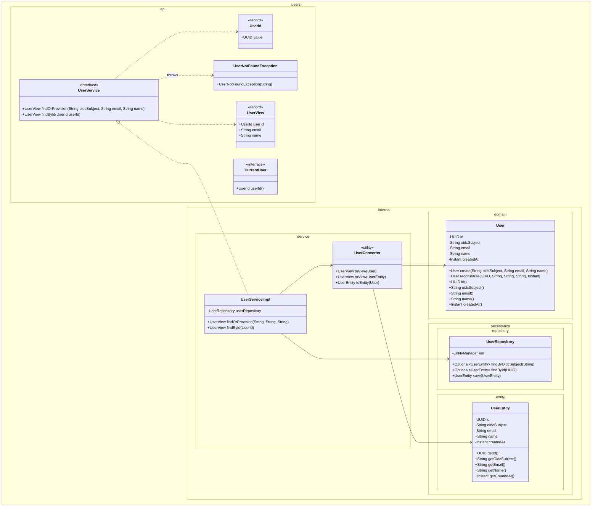
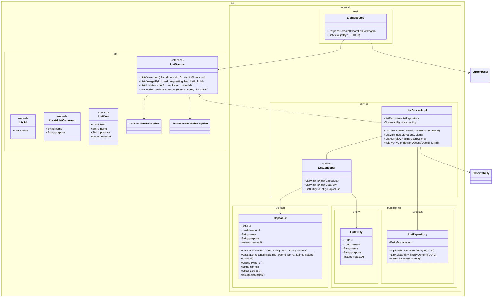
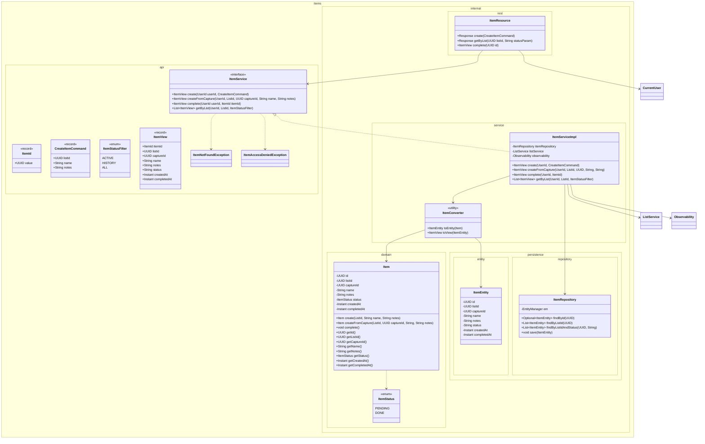
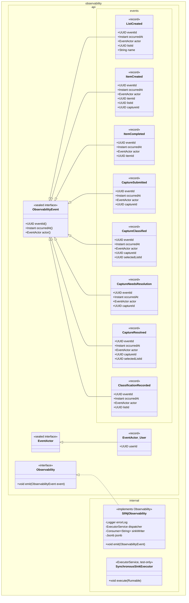
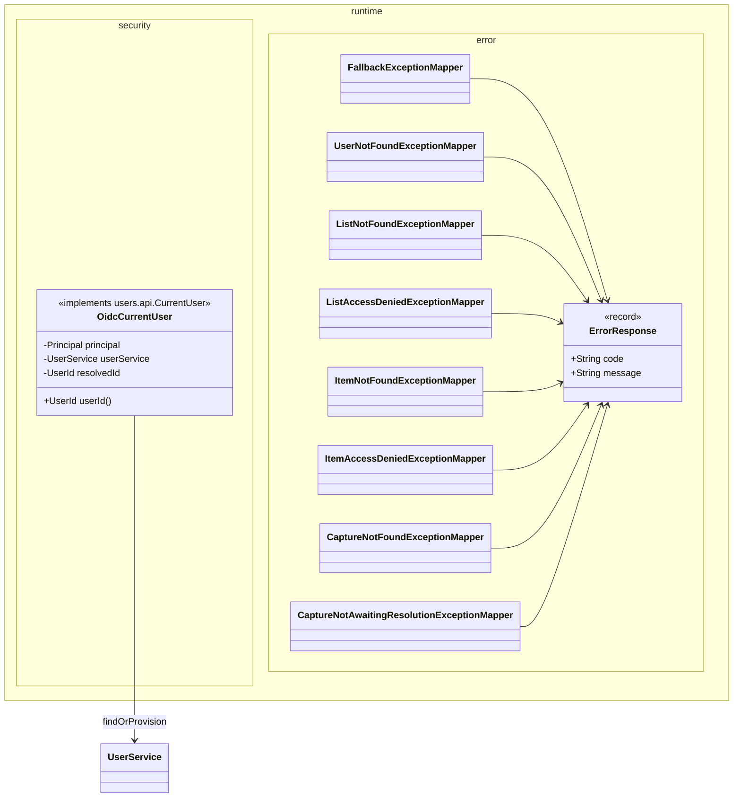

# Class Diagrams

**Status:** v0.1 (current implementation)
**Scope:** One class diagram per Maven/JPMS module, showing public API,
internal domain, internal services, persistence entities and repositories,
and (for capability modules) the per-module REST resource.

Diagrams cover **only the types that exist in source today**. Visibility
markers (`+`, `-`) follow Java access: `-` private field, `+` public method.
Internal collaborator types are shown without their own packages to keep each
diagram focused; cross-module references appear with their fully qualified
name (e.g. `users.api.UserId`).

Conventions used in every diagram:

- **Aggregate roots** appear in `internal/domain` (or, for `capture`, as the
  `Capture` record in `internal/domain`).
- **Public service** is the interface in `*.api`; the concrete implementation
  is `@ApplicationScoped` in `internal/service` and named `<Name>ServiceImpl`.
- **REST resources** live in `internal/rest` inside each capability module
  and are discovered via CDI index from `capsa-runtime`.
- **Persistence** types (`*Entity`, `*Repository`) are package-private to
  their module's `internal.persistence.*` packages (not exported).

---

## 1. `capsa-users`

`User` aggregate + OIDC-provisioned identity + request-scoped `CurrentUser`
binding. The leaf of the capability graph — depends on no other capability.

**Notes**

- `User` is immutable; factory `create(...)` enforces invariants
  (`oidcSubject`, `email` non-blank), `reconstitute(...)` is for repository
  rehydration only.
- `UserServiceImpl.findOrProvision` is idempotent on `oidcSubject` — a second
  call for the same subject returns the existing `UserView`.
- `CurrentUser` is provided by `capsa-runtime`'s `OidcCurrentUser` and is
  injected by capability REST resources.

---

## 2. `capsa-lists`

Owns `CapsaList`. Holds the owner check that other capabilities call before
mutating a list's contents (`verifyContributionAccess`).

**Notes**

- `CapsaList` does **not** hold its items in memory; `Item` is a separate
  aggregate queried by `listId + status` via `ItemRepository`.
- `verifyContributionAccess(...)` is the single authorization gate used by
  `capsa-items` and `capsa-capture` before any mutation on a list's contents.
- On successful create, `ListServiceImpl` emits `observability.ListCreated`.

---

## 3. `capsa-items`

Owns `Item`. Handles UC-02 (direct add), UC-04 (item from capture),
UC-05 (list-filtered reads), UC-06 (completion).

**Notes**

- `Item.complete()` is idempotent: a second call on an already-`DONE` item is
  a no-op; no second `ItemCompleted` observability event is emitted.
- `createFromCapture` is invoked by `capsa-capture` after either an automatic
  classification (UC-03) or a user resolution (UC-04). It records `captureId`
  on the item for traceability.
- `getByList` enforces ownership via `ListService.verifyContributionAccess`
  before the repository query runs.

---

## 4. `capsa-capture`

The orchestration module for the smart-capture path (UC-03 / UC-04). Splits
into three internal services: `CaptureCreationService` persists the raw
capture and emits `CaptureSubmitted`; `CaptureServiceImpl` (the public API)
calls the `Classifier` and dispatches on outcome; `CaptureResolutionService`
mutates the capture and creates the downstream `Item`.

```mermaid
classDiagram
    namespace capture.api {
        class CaptureId {
            <<record>>
            +UUID value
        }
        class SubmitCaptureCommand {
            <<record>>
            +String content
        }
        class ClassificationCandidate {
            <<record>>
            +UUID listId
            +double confidence
            +String explanation
        }
        class CaptureResult {
            <<sealed interface>>
        }
        class CaptureResult_Classified {
            <<record>>
            +ItemView item
        }
        class CaptureResult_NeedsResolution {
            <<record>>
            +CaptureId captureId
            +List~ClassificationCandidate~ candidates
        }
        class CaptureService {
            <<interface>>
            +CaptureResult submit(UserId, String content)
            +ItemView resolve(UserId, CaptureId, ListId)
        }
        class CaptureNotFoundException
        class CaptureNotAwaitingResolutionException
    }

    namespace capture.internal.domain {
        class Capture {
            <<record>>
            +UUID captureId
            +String originalContent
            +String normalizedContent
        }
        class CaptureNormalizer {
            <<utility>>
            +String normalize(String)
        }
    }

    namespace capture.internal.persistence.entity {
        class CaptureEntity {
            +UUID id
            +UUID userId
            +String originalContent
            +String normalizedContent
            +String processingStatus
            +Instant capturedAt
        }
        class ClassificationAttemptEntity {
            +UUID id
            +UUID captureId
            +String outcome
            +String candidates
            +Instant attemptedAt
        }
        class ClassificationResolutionEntity {
            +UUID id
            +UUID captureId
            +UUID selectedListId
            +String resolvedBy
            +Instant resolvedAt
        }
    }

    namespace capture.internal.persistence.repository {
        class CaptureRepository {
            -EntityManager em
            +void persist(CaptureEntity)
            +Optional~CaptureEntity~ findById(UUID)
        }
        class ClassificationAttemptRepository {
            -EntityManager em
            +void persist(ClassificationAttemptEntity)
            +Optional~ClassificationAttemptEntity~ findByCaptureId(UUID)
        }
        class ClassificationResolutionRepository {
            -EntityManager em
            +void persist(ClassificationResolutionEntity)
        }
    }

    namespace capture.internal.service {
        class CaptureServiceImpl {
            -CaptureCreationService captureCreationService
            -CaptureResolutionService captureResolutionService
            -Classifier classifier
            +CaptureResult submit(UserId, String)
            +ItemView resolve(UserId, CaptureId, ListId)
        }
        class CaptureCreationService {
            -CaptureRepository captureRepository
            -ClassificationAttemptRepository attemptRepository
            -Observability observability
            +Capture createCapture(UserId, String originalContent, String normalizedContent)
        }
        class CaptureResolutionService {
            -CaptureRepository captureRepository
            -ClassificationAttemptRepository attemptRepository
            -ClassificationResolutionRepository resolutionRepository
            -ItemService itemService
            -ClassificationService classificationService
            -Observability observability
            +ItemView resolveCapture(UserId, Capture, ClassificationResult)
            +void storeNeedsResolution(Capture, ClassificationResult)
            +void markFailed(UUID captureId)
            +ItemView resolveFromUser(UserId, CaptureId, ListId)
        }
    }

    namespace capture.internal.rest {
        class CaptureResource {
            +Response submit(SubmitCaptureCommand)
            +Response resolve(UUID id, ResolveRequest)
        }
        class ResolveRequest {
            <<record>>
            +UUID listId
        }
    }

    CaptureService <|.. CaptureServiceImpl
    CaptureServiceImpl --> CaptureCreationService
    CaptureServiceImpl --> CaptureResolutionService
    CaptureServiceImpl --> Classifier
    CaptureCreationService --> CaptureRepository
    CaptureCreationService --> ClassificationAttemptRepository
    CaptureCreationService --> CaptureNormalizer
    CaptureResolutionService --> CaptureRepository
    CaptureResolutionService --> ClassificationAttemptRepository
    CaptureResolutionService --> ClassificationResolutionRepository
    CaptureResolutionService --> ItemService
    CaptureResolutionService --> ClassificationService
    CaptureServiceImpl ..> CaptureNormalizer : normalize()
    CaptureResult <|-- CaptureResult_Classified
    CaptureResult <|-- CaptureResult_NeedsResolution
    CaptureResource --> CaptureService
    CaptureResource --> CurrentUser
    CaptureService ..> CaptureNotFoundException
    CaptureService ..> CaptureNotAwaitingResolutionException
```

**Notes**

- `Capture` is a Java `record` holding `originalContent` (preserved exactly)
  and `normalizedContent` (the result of `CaptureNormalizer.normalize` —
  `strip`, lowercase, collapse whitespace). Both forms are stored so that
  historical classification behavior is anchored to the normalization rules
  in effect at capture time.
- `CaptureEntity.processingStatus` transitions: `PROCESSING → CLASSIFIED |
  NEEDS_RESOLUTION → RESOLVED` (or `FAILED` on pipeline exception).
- `CaptureResolutionEntity` has `unique (capture_id)` — a Capture resolves at
  most once (UC-04 idempotency invariant).
- Pipeline exceptions are not represented in `CaptureResult`; they propagate
  out and the capture is marked `FAILED` before the throw.

---

## 5. `capsa-classification`

Owns the `Classifier` capability abstraction and the `KnownClassificationStrategy`
(the only strategy currently wired into `ClassificationPipeline`). `Classifier`
is the only classification type the rest of the system depends on; concrete
strategies and the pipeline are internal.

```mermaid
classDiagram
    namespace classification.api {
        class ClassificationTarget {
            <<record>>
            +UUID listId
            +String name
            +String explicitPurpose
        }
        class ClassificationRequest {
            <<record>>
            +UserId userId
            +String normalizedContent
            +List~ClassificationTarget~ candidates
        }
        class ClassificationCandidate {
            <<record>>
            +UUID listId
            +double confidence
            +String explanation
        }
        class ClassificationResult {
            <<record>>
            +Outcome outcome
            +List~ClassificationCandidate~ candidates
            +UUID selectedListId
            +Map~String,String~ metadata
        }
        class Outcome {
            <<enum>>
            CLASSIFIED
            NEEDS_RESOLUTION
        }
        class Classifier {
            <<interface>>
            +ClassificationResult classify(ClassificationRequest)
        }
        class ClassificationService {
            <<interface>>
            +void recordResolution(UserId, String normalizedContent, UUID selectedListId)
        }
    }

    namespace classification.internal.domain {
        class ClassificationMemoryEntry {
            -UUID id
            -UserId userId
            -String normalizedContent
            -UUID selectedListId
            -Source source
            -Instant recordedAt
            +ClassificationMemoryEntry create(UserId, String, UUID, Source)
            +ClassificationMemoryEntry reconstitute(UUID, UserId, String, UUID, Source, Instant)
        }
        class Source {
            <<enum>>
            AUTO
            USER_CONFIRMED
        }
    }

    namespace classification.internal.persistence.entity {
        class ClassificationMemoryEntryEntity {
            -UUID id
            -UUID userId
            -String normalizedContent
            -UUID selectedListId
            -String source
            -Instant recordedAt
        }
    }

    namespace classification.internal.persistence.repository {
        class ClassificationMemoryEntryRepository {
            -EntityManager em
            +Optional~ClassificationMemoryEntryEntity~ findLatestUserConfirmed(UserId, String)
            +void save(ClassificationMemoryEntryEntity)
        }
    }

    namespace classification.internal.service {
        class ClassificationPipeline {
            <<implements Classifier>>
            -List~ClassificationStrategy~ strategies
            +ClassificationResult classify(ClassificationRequest)
        }
        class ClassificationStrategy {
            <<interface, package-private>>
            +ClassificationResult classify(ClassificationRequest)
        }
        class KnownClassificationStrategy {
            -ClassificationMemoryEntryRepository repository
            +ClassificationResult classify(ClassificationRequest)
        }
        class ClassificationServiceImpl {
            -ClassificationMemoryEntryRepository repository
            -Observability observability
            +void recordResolution(UserId, String, UUID)
        }
    }

    Classifier <|.. ClassificationPipeline
    ClassificationPipeline o-- ClassificationStrategy
    ClassificationStrategy <|.. KnownClassificationStrategy
    KnownClassificationStrategy --> ClassificationMemoryEntryRepository
    ClassificationService <|.. ClassificationServiceImpl
    ClassificationServiceImpl --> ClassificationMemoryEntryRepository
    ClassificationServiceImpl --> Observability
    ClassificationResult ..> Outcome
    ClassificationMemoryEntry ..> Source
```

**Notes**

- `Classifier.classify` is the only contract `capsa-capture` depends on.
- The pipeline executes strategies in order; the first strategy that returns
  `Outcome.CLASSIFIED` terminates the pipeline. If all return `NEEDS_RESOLUTION`,
  the pipeline returns the last result.
- `ClassificationMemoryEntry` is append-only. The `KnownClassificationStrategy`
  queries by `(userId, normalizedContent, source = USER_CONFIRMED)` and returns
  the most recent `USER_CONFIRMED` entry.
- `recordResolution` always records with `Source.USER_CONFIRMED`; the capture
  module calls it only after a user resolution (UC-04). Auto-classified
  outcomes are persisted as a `ClassificationResolutionEntity` in
  `capsa-capture`, not as a memory entry.

---

## 6. `capsa-observability`

Capability-facing port for emitting structured events. The implementation
dispatches asynchronously on a virtual-thread executor and serializes via
JSON-B; a `SynchronousSinkExecutor` exists for synchronous test observation.

**Notes**

- The port is best-effort and asynchronous. `emit(...)` returns to the calling
  business thread immediately and never throws. Sink failures are logged via the
  standard application logger (`Slf4jObservability.errorLog`).
- JSON-B serialization uses a discriminator property `type` for
  `ObservabilityEvent` variants and `kind` for `EventActor` variants.
- `capsa-observability` depends only on `capsa-users` for `UserId` (used
  inside `EventActor.User`).

---

## 7. `capsa-runtime`

Composition root. Wires every capability, provides the OIDC-backed
`CurrentUser` implementation, owns the exception mappers, and integrates
Flyway/Hibernate/Postgres. No `api` package.

**Notes**

- `OidcCurrentUser` is `@RequestScoped` and `lazy`-resolves the
  `UserId` by calling `UserService.findOrProvision` once per request, reading
  `sub`, `email`, `name` from the `JsonWebToken`.
- One dedicated exception mapper per public exception type (not-found and
  access-denied for `User`, `List`, `Item`, `Capture`). A
  `FallbackExceptionMapper` handles anything that escapes the capability
  services.
- `application.properties` declares `quarkus.index-dependency.*` for every
  capability JAR so Quarkus discovers their CDI beans and entities without
  module-path scanning.

---

## Cross-module type usage

The following non-trivial cross-module references exist today (verified from
source). Anything not listed is contained within a single module.

| Type                              | Used by                                              |
|-----------------------------------|------------------------------------------------------|
| `users.api.UserId`                | `lists.api.ListService`, `items.api.ItemService`, `capture.api.CaptureService`, `classification.api.ClassificationRequest`, `observability.api.EventActor.User` |
| `users.api.CurrentUser`           | `lists.internal.rest.ListResource`, `items.internal.rest.ItemResource`, `capture.internal.rest.CaptureResource`, `runtime.security.OidcCurrentUser` (implements) |
| `users.api.UserService`           | `runtime.security.OidcCurrentUser`                   |
| `users.api.UserView`               | `users.internal.service.UserServiceImpl` (returns)   |
| `lists.api.ListService`           | `items.internal.service.ItemServiceImpl`, `capture.internal.service.CaptureResolutionService` |
| `lists.api.ListId`                | `items.internal.domain.Item` (in `create` / `createFromCapture`), `capture.api.CaptureService.resolve` |
| `items.api.ItemService`           | `capture.internal.service.CaptureResolutionService`  |
| `items.api.ItemView`              | `capture.api.CaptureResult.Classified` (returned)    |
| `classification.api.Classifier`   | `capture.internal.service.CaptureServiceImpl`        |
| `classification.api.ClassificationService` | `capture.internal.service.CaptureResolutionService` |
| `observability.api.Observability` | `lists.internal.service.ListServiceImpl`, `items.internal.service.ItemServiceImpl`, `capture.internal.service.*`, `runtime` (wires `Slf4jObservability`) |