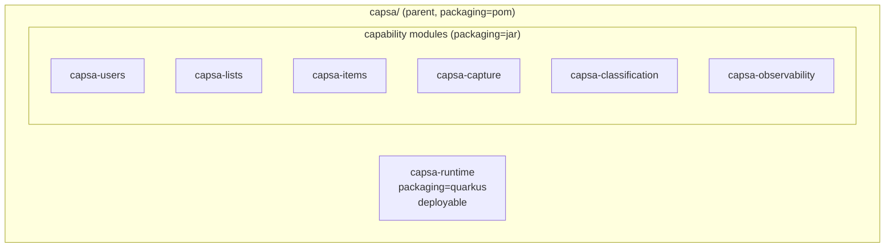
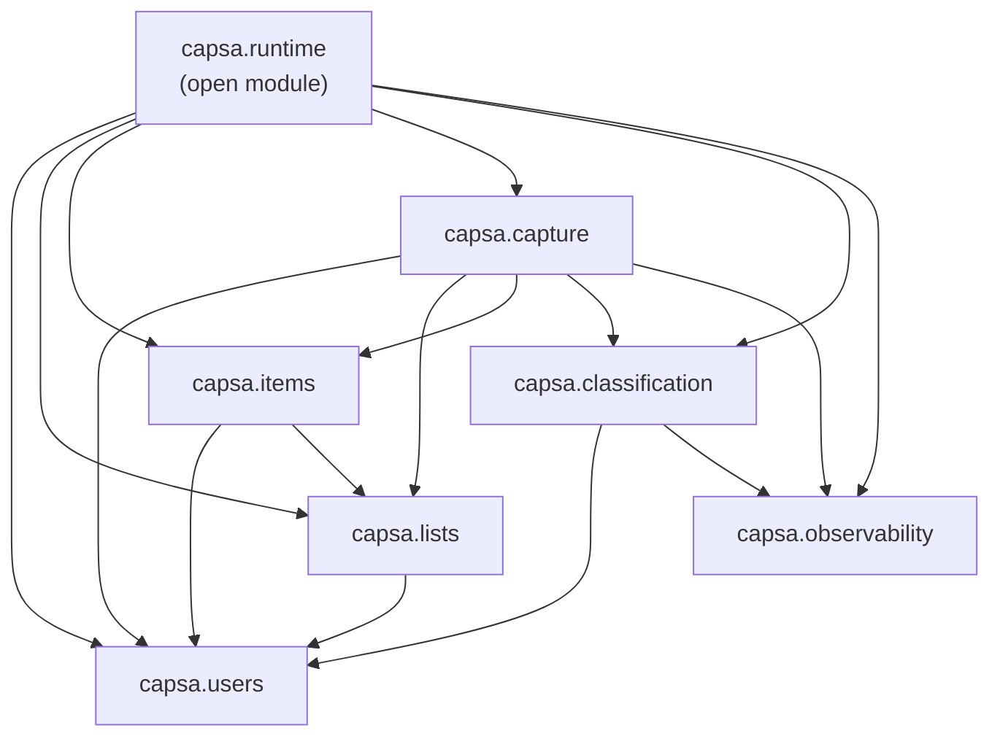
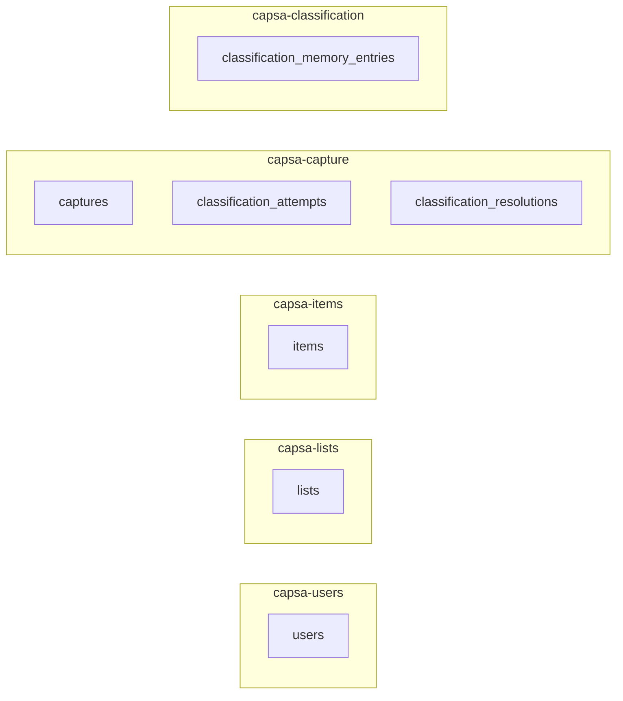
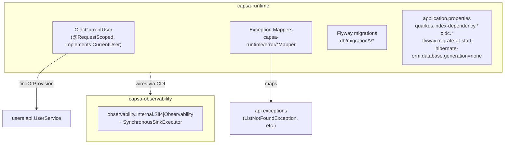

# Module Diagram

**Status:** v0.1 (current implementation)
**Scope:** Capsa Maven modules, JPMS layering, capability dependencies, and runtime wiring.
**Source of truth:** the seven modules under `capsa/` and their `module-info.java` files.

This diagram supplements the prose architecture in
[capsa-arch-001-modular-monolith-v0.1.md](../capsa-arch-001-modular-monolith-v0.1.md).

---

## 1. Maven modules and packaging

Seven sibling modules under the `capsa/` Maven parent. `capsa-runtime` is the only
module with `<packaging>quarkus</packaging>` and the Quarkus Maven plugin; all others
are plain `jar` capability modules that ship as libraries indexed by Quarkus at
runtime via `quarkus.index-dependency.*` in `application.properties`.

---

## 2. JPMS module layering and capability dependencies

Every Maven module is also a JPMS module. Each module exports only
`com.capsa.<capability>.api`; internal packages are not exported but are
deliberately `opens` for Hibernate reflection and CDI proxies (see
[capsa-arch-001](../capsa-arch-001-modular-monolith-v0.1.md) §1 and the
`AGENTS.md` JPMS rules).

Arrows below represent JPMS `requires` edges as declared in each
`module-info.java`.

**Why each edge exists** (verified from `module-info.java` and source imports):

| From → To                | Reason (exported type used)                                                  |
|--------------------------|-------------------------------------------------------------------------------|
| `lists → users`           | `UserId` in `ListService` signatures; `CurrentUser` injected by `ListResource` |
| `items → users`          | `UserId` in `ItemService` signatures; `CurrentUser` injected by `ItemResource` |
| `items → lists`          | `ListService.verifyContributionAccess(...)` for UC-02 / UC-06                 |
| `capture → users`        | `UserId`, `CurrentUser`                                                       |
| `capture → lists`        | `ListService.getByUser(...)` (candidate lists), `verifyContributionAccess(...)` (UC-04) |
| `capture → items`        | `ItemService.createFromCapture(...)` (UC-03 happy path / UC-04)              |
| `capture → classification`| `Classifier.classify(...)`, `ClassificationService.recordResolution(...)`    |
| `classification → users` | `UserId` in `ClassificationRequest` (per-user memory scope)                   |
| `runtime → all`          | Composition root; wires every capability and provides the OIDC `CurrentUser` implementation |

**Prohibited edges** (enforced by JPMS `requires` absence): no capability depends
on `runtime`; `users` depends on no other capability; no capability reaches into
another capability's `internal` package (those packages are unexported).

---

## 3. Capability ownership of persistence tables

A capability is the sole writer and reader of its own tables. The boundary is
enforced by both JPMS and the repository-only-via-`api` convention.

**Entity-to-table mapping:**

| Module                | Entity                         | Table                              |
|-----------------------|--------------------------------|------------------------------------|
| `capsa-users`         | `UserEntity`                   | `users`                            |
| `capsa-lists`         | `ListEntity`                   | `lists`                            |
| `capsa-items`         | `ItemEntity`                   | `items`                            |
| `capsa-capture`       | `CaptureEntity`                | `captures`                         |
| `capsa-capture`       | `ClassificationAttemptEntity`  | `classification_attempts`          |
| `capsa-capture`       | `ClassificationResolutionEntity` | `classification_resolutions`     |
| `capsa-classification`| `ClassificationMemoryEntryEntity` | `classification_memory_entries` |

---

## 4. Runtime composition

`capsa-runtime` is the only module wired into the Quarkus build. It owns the
HTTP boundary (Jakarta REST resources are co-located in capability modules and
discovered via CDI index), OIDC, the OIDC → `User` provisioning bridge, and the
exception mappers that translate `api`-package exceptions into HTTP responses.

The Quarkus build, Postgres driver, Hibernate ORM, Flyway, OIDC, REST, and
JSON-B are all declared as direct dependencies of `capsa-runtime` only. The
capability modules remain framework-light (`jakarta.*`, `slf4j-api`, JUnit).

---

## 5. Capability layer responsibilities

| Module                  | Responsibility                                                                                                              | Public service (in `*.api`)          |
|-------------------------|------------------------------------------------------------------------------------------------------------------------------|--------------------------------------|
| `capsa-users`           | Owns the `User` identity. Provisions the `User` from OIDC claims and exposes `CurrentUser` for request-scoped auth context.   | `UserService`, `CurrentUser`         |
| `capsa-lists`           | Owns `CapsaList`. Authoritative for list ownership and the contribution-access check used by other capabilities.             | `ListService`                        |
| `capsa-items`           | Owns `Item`. Handles direct create (UC-02), capture-resolved create (UC-04), completion (UC-06), and list-filtered reads (UC-05). | `ItemService`                        |
| `capsa-capture`         | Orchestrates the smart-capture path: persist → normalize → classify → resolve (UC-03 / UC-04).                                | `CaptureService`                     |
| `capsa-classification`  | Owns the `Classifier` abstraction and the `KnownClassificationStrategy` (memory-backed) pipeline; append-only `ClassificationMemory`. | `Classifier`, `ClassificationService` |
| `capsa-observability`   | Capability-facing port for emitting structured events; SLF4J sink implementation.              | `Observability`                      |
| `capsa-runtime`         | Composition root: HTTP wiring, OIDC integration, Flyway migrations, exception mapping, integration tests.                    | (no `api` package)                   |