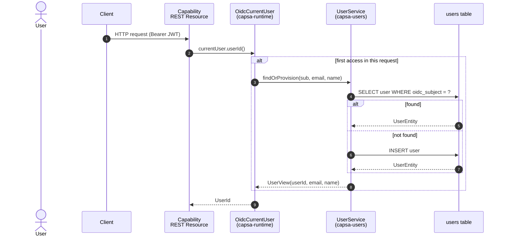
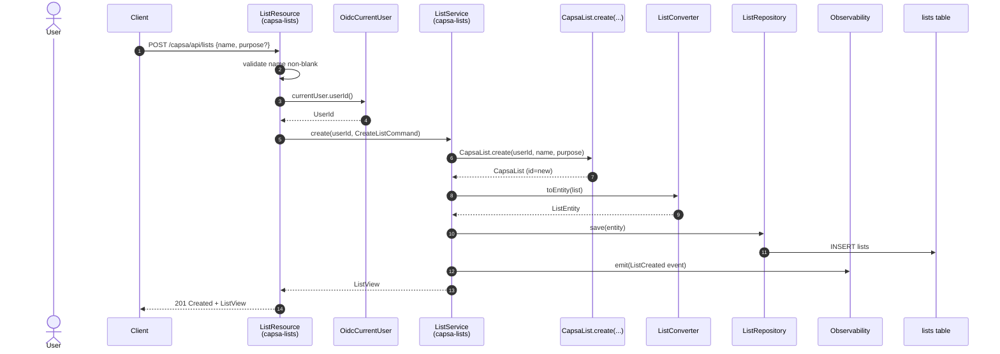
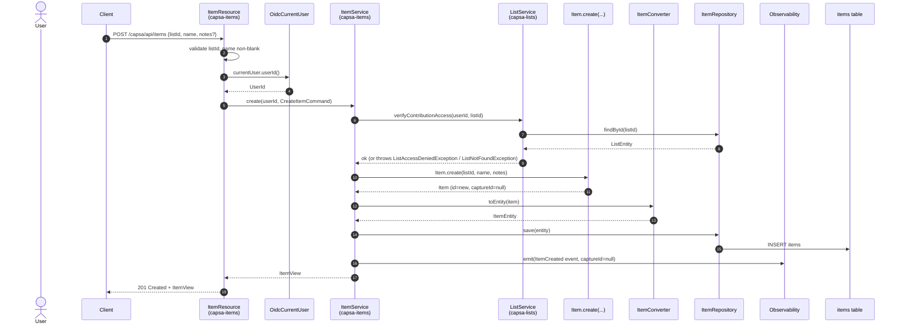
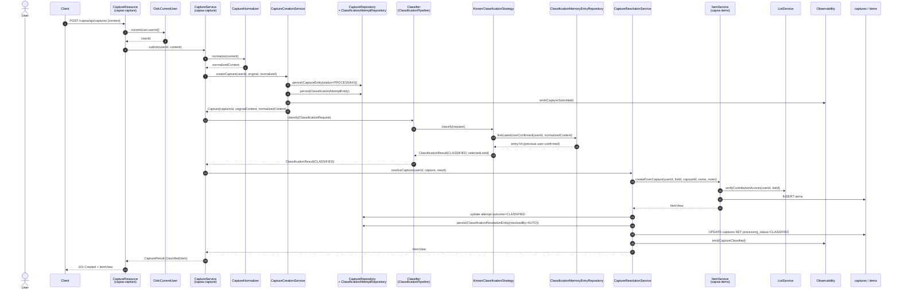
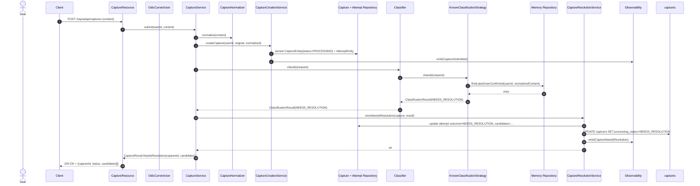
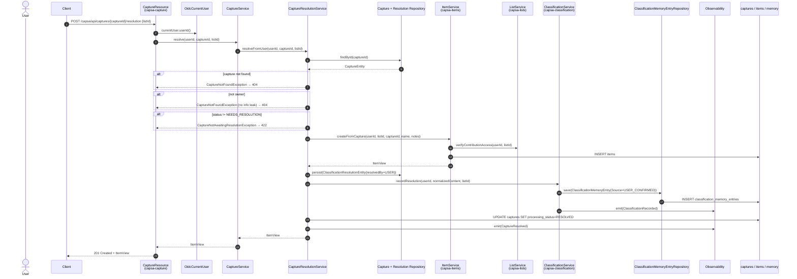
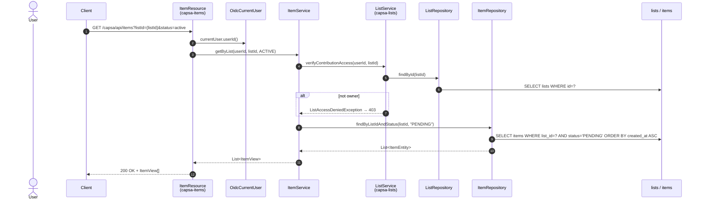
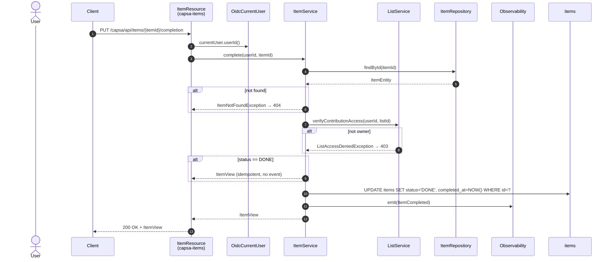
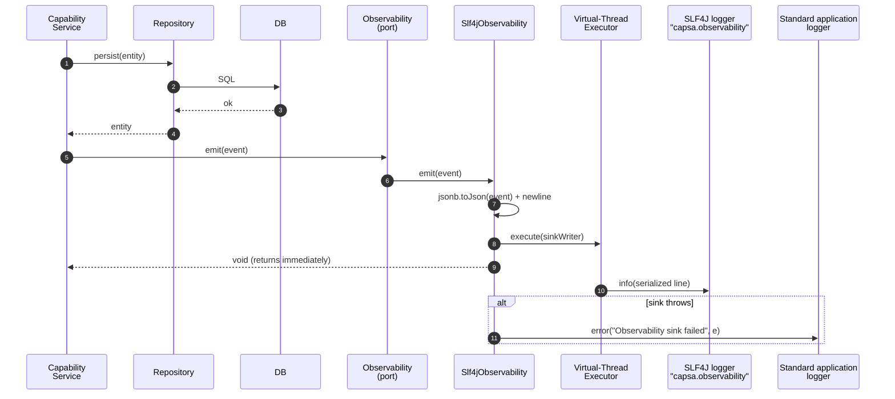
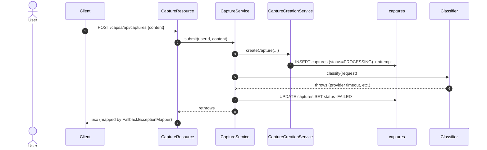

# Sequence Diagrams — Business Flows

**Status:** v0.1 (current implementation)
**Scope:** End-to-end flows for UC-01 through UC-06, plus the cross-cutting
authentication step that precedes every authenticated request. Each diagram
shows the public API contracts and the major internal collaborators
sufficient to understand the flow; persistence is collapsed into the
repository step.

Diagrams reflect the **actual** request path in the code today. The contracts
shown are the public services in each module's `api` package, not REST
resources (which sit in `internal.rest` and are the only HTTP entry point).

Use case sources:

- [UC-01 Create List](../../use-cases/uc-01-create-list.md)
- [UC-02 Add Item to List](../../use-cases/uc-02-add-item-to-list.md)
- [UC-03 Automatically Classify Capture](../../use-cases/uc-03-automatically-classify-capture.md)
- [UC-04 Resolve Ambiguous Classification](../../use-cases/uc-04-resolve-ambiguous-classification.md)
- [UC-05 View List](../../use-cases/uc-05-view-list.md)
- [UC-06 Complete Item](../../use-cases/uc-06-complete-item.md)

---

## 0. Authenticated request — `CurrentUser` resolution

Every authenticated request resolves the `CurrentUser` once. The `OidcCurrentUser`
bean is `@RequestScoped`; `userId()` is lazy.

`UserService.findOrProvision` is idempotent on `oidcSubject`. The
`UserView` value is cached on the bean for subsequent `currentUser.userId()`
calls in the same request.

---

## 1. UC-01 — Create List

Failure paths (not shown): blank name → 422 validation; OIDC disabled in
`%dev`/`%test` so the test profile uses `@TestSecurity` instead of a JWT.

---

## 2. UC-02 — Add Item to List (direct)

---

## 3. UC-03 — Submit Capture (happy path: auto-classified)

This is the "smart capture" path. The `Classifier` is the
`capsa-classification` public interface; the `KnownClassificationStrategy` is the
only strategy currently registered in `ClassificationPipeline`.

Notes:

- `Item.createFromCapture` records `captureId` on the item, making the
  Capture ↔ Item traceability permanent.
- A `ClassificationResolutionEntity` with `resolvedBy=AUTO` is persisted.
  `ClassificationMemoryEntry` is **not** written for auto-classified captures
  (the memory entry is written only on user-confirmed resolution, UC-04).
- Pipeline exceptions are not represented in `CaptureResult`. The
  `CaptureServiceImpl.submit` catch block calls `CaptureResolutionService.markFailed`
  and rethrows.

---

## 4. UC-03 — Submit Capture (uncertain → `NEEDS_RESOLUTION`)

Same shape as the happy path, but the `Classifier` returns
`Outcome.NEEDS_RESOLUTION`. No `Item` is created.

The `candidates` list is empty for the current `KnownClassificationStrategy`;
it is the contract seam where future strategies will provide ranked
suggestions. The client is not required to pick from `candidates` — UC-04
allows the user to select any list they own.

---

## 5. UC-04 — Resolve ambiguous classification

The `ClassificationResolutionEntity` has a `UNIQUE(capture_id)` constraint;
a concurrent second resolve for the same capture fails with a constraint
violation rather than producing a duplicate `Item`. The
`ClassificationMemoryEntry` row is what makes the next identical capture
classifiable by the `KnownClassificationStrategy`.

---

## 6. UC-05 — View List

`status` query parameter values: `active` (default → `PENDING`), `history`
(→ `DONE`), `all` (no status filter). `HISTORY` returns `DONE` items still
associated with the original list (no archive list exists — see UC-02/UC-06
notes in the use case documents).

---

## 7. UC-06 — Complete Item

`complete` is idempotent: a second `PUT` against an already-`DONE` item
returns the same `ItemView` without emitting a second `ItemCompleted` event.
The item is never moved to a different list and never deleted; `list_id` is
immutable from creation.

---

## 8. Cross-flow — Observability emission

Observability events are emitted in the service layer **after** the
persistence operation succeeds but **before** the service method returns.
The `Observability.emit(...)` call returns immediately (virtual-thread
dispatch); a sink failure is logged to the standard application logger and
never propagated to the caller. This makes observability best-effort and
out of any synchronous business transaction.

Capability services do not couple to a specific sink. The default sink is the
dedicated SLF4J logger `capsa.observability` (logger name constant
`Slf4jObservability.LOGGER_NAME`); future adapters (Kafka, OpenTelemetry,
durable outbox) bind a different `Observability` bean at composition time in
`capsa-runtime` without any change to capability code.

---

## 9. Failure mode — Pipeline exception during UC-03

The capture is left in `FAILED` so the user can be notified or retry;
no `Item` is created. `ClassificationRecovery` distinguishes this from
`NEEDS_RESOLUTION` (uncertainty vs. execution failure).