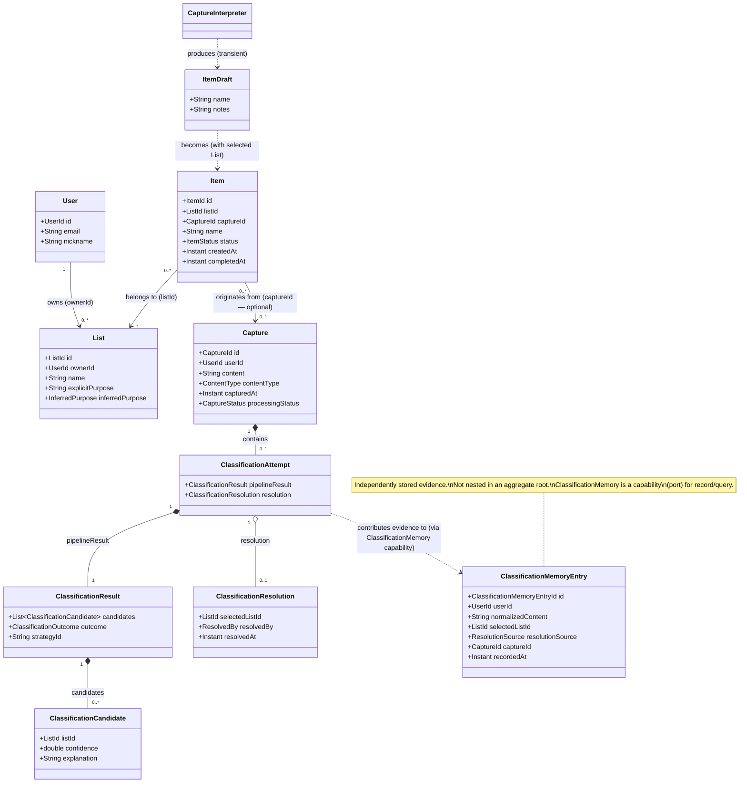

# Capsa v0.1 Domain Model

**Role:** product-architect (CAPSA-DOMAIN-001) · software-engineer reconciliation (CAPSA-DOMAIN-RECONCILE-001) · hygiene update (2026-10-03)  
**Source authority:** UC-01 through UC-06 (current versions)  
**Review:** CAPSA-DOMAIN-REVIEW-001 — CHANGES REQUIRED resolved by CAPSA-DOMAIN-RECONCILE-001  
**Status:** Current — reflects v0.1 use cases and S-05 implementation decisions

---

## 1. Domain Overview

Capsa's domain is built around one central question: *where does this captured intent belong?*

A User submits raw content — a Capture — and Capsa normalizes it, interprets it into an actionable form, classifies it against the User's semantic Lists, and produces a pending Item in the appropriate List. When classification is confident, this happens without interruption. When it is not, Capsa asks rather than guesses.

The domain has two distinct entry paths for Item creation:

| Path | Use Case | Description |
|---|---|---|
| **Direct add** | UC-02 | User knows the destination; no Capture or classification needed |
| **Smart capture** | UC-03 / UC-04 | Capsa determines the destination from the Capture's content |

Both paths produce the same concept: a `PENDING` Item belonging to a List.

**Central relationships:**

- A User owns Lists
- Lists receive Items; Items reference their List by ID (Lists do not hold collections of Items in memory)
- Captures produce Items through normalization, interpretation, and classification
- ClassificationMemory accumulates evidence from past classifications and User resolutions, feeding the Known Classification strategy

```
User ──owns──► List ◄──belongs to── Item
                                     ▲
Capture ──classified into──► List    │
    │                                │
    └──────────produces──────────────┘
```

---

## 2. Domain Concepts

### User

**Responsibility:** Represents a Capsa account holder who owns Lists, submits Captures, and resolves ambiguous classifications.

**Classification:** Entity, Aggregate Root

**Candidate state:**

```
UserId      id
String      email
String      nickname
String      photoReference    (optional)
```

Authentication credentials (e.g. password hash) are associated with User but the exact mechanism is TBD. Passwords are never stored reversibly. Auth mechanism details belong to a future architectural decision.

**Invariants:**
- `id` is non-null after creation
- `email` is non-blank and structurally valid
- Credentials are never stored in reversible form

**Lifecycle:** No terminal lifecycle state defined in v0.1.

---

### List

**Responsibility:** A named, semantic collection owned by a User. Provides the destination for Items and the semantic criteria Capsa uses to determine whether a Capture belongs to it.

**Classification:** Entity, Aggregate Root

**Candidate state:**

```
ListId          id
UserId          ownerId
String          name               required; non-blank
String          explicitPurpose    optional; user-provided semantic description
InferredPurpose inferredPurpose    optional; derived from item history — MUST remain separate from explicit purpose
```

**On `explicitPurpose` vs `inferredPurpose`:**  
UC-01 establishes that these must never be silently conflated. An inferred purpose is a candidate suggestion, not promoted to user-defined truth without explicit User consent. The representation of `InferredPurpose` (whether stored, computed on demand, or deferred entirely to a later feature) remains an open question.

**Key design decision — Items are not held as a collection on List:**  
Items reference their List by `ListId`. A List aggregate does not hold an in-memory collection of its Items. UC-05 retrieves Items via a repository query filtered by `listId` and `status`. This avoids loading full Item histories when a List is accessed and supports future List growth without aggregate redesign.

**Invariants:**
- `id` is non-null after creation
- `ownerId` is non-null
- `name` is non-blank
- `explicitPurpose ≠ inferredPurpose` — these fields must never be conflated or overwrite each other

---

### Item

**Responsibility:** An actionable or retainable occurrence produced either by direct User input or smart capture. Each Item represents a specific occurrence, not a recurring real-world concept. Repeated needs create new occurrences.

**Classification:** Entity, Aggregate Root

**Candidate state:**

```
ItemId      id
ListId      listId             required; never changes after creation
CaptureId   captureId          optional; null for direct adds (UC-02); provides origin traceability
String      name               required; non-blank
String      notes              optional
ItemStatus  status             PENDING | DONE
Instant     createdAt          domain-significant history
Instant     completedAt        null until DONE; domain-significant history
```

**Why Item is its own Aggregate Root (not nested in List):**
Items have an independent lifecycle. They are queried by `listId + status` independently of List retrieval. Lists may accumulate large Item histories. Treating Item as a separate aggregate avoids loading all history when a List is viewed and allows Item operations (complete, query) without touching the List aggregate.

**Invariants:**
- `id` is non-null after creation
- `listId` is non-null and never changes
- `name` is non-blank
- `status == PENDING` on creation
- `createdAt` is non-null
- `completedAt != null` iff `status == DONE`
- `completedAt == null` for all non-`DONE` states
- A completed Item is never reopened; a new need creates a new Item occurrence
- Completion never changes `listId`
- Completion never deletes the Item

---

### Capture

**Responsibility:** Immutable evidence of content received by Capsa. Preserved before and regardless of classification outcome. The Capture represents what Capsa actually received, not what was ultimately stored as an Item.

**Classification:** Entity, Aggregate Root

**Candidate state:**

```
CaptureId       id
UserId          userId
String          content              original; immutable; never modified
String          normalizedContent    derived; stored alongside original (see note)
ContentType     contentType          TEXT in v0.1; extensible
Instant         capturedAt
CaptureStatus   processingStatus
```

**On `normalizedContent` storage:** Storing `normalizedContent` on `Capture` rather than recomputing on demand is justified: (a) normalization rules must remain stable for `ClassificationMemory` matching; (b) if normalization logic ever changes, historical evidence remains anchored to the representation used at classification time. Recomputing on demand would silently change the matching behavior for historical Captures. Resolved in v0.1 implementation.

**Contained within Capture aggregate:**
- `ClassificationAttempt` (optional; created during UC-03 pipeline execution)

**CaptureStatus lifecycle:**

```
PROCESSING → CLASSIFIED
         └→ NEEDS_RESOLUTION → RESOLVED
         └→ FAILED
```

`NEEDS_RESOLUTION` and `FAILED` are distinct states. `NEEDS_RESOLUTION` means the pipeline could not classify confidently; `FAILED` means infrastructure or execution failure. They must not be conflated (established by UC-03 Failure Considerations).

**On the absence of `RECEIVED`:** A conceptual `RECEIVED` state (capture persisted before classification begins) is achievable in v0.1 by the two-transaction pattern — TX-1 persists the Capture, TX-2 resolves the outcome. The initial `processingStatus` is `PROCESSING` because classification begins immediately. A separate `RECEIVED` state would only be useful for async capture channels (e.g. message queue, webhook) where a Capture is received and queued before processing starts. Deferred to when such a channel exists.

**Aggregate-internal invariants:**
- `id` is non-null
- `userId` is non-null
- `content` is non-blank and never modified after creation
- `capturedAt` is non-null
- A Capture accepts at most one `ClassificationResolution`; the transition from `NEEDS_RESOLUTION` to `RESOLVED` is irreversible and occurs at most once
- `pipelineResult` is append-only; it is never overwritten
- An Item is never created from an unresolved Capture

**Cross-aggregate guarantee (not enforceable by the Capture aggregate alone):**
Exactly one Item per resolved Capture is enforced by the application layer through transactional coordination, idempotency, and a persistence uniqueness constraint (e.g. a unique index on `Item.captureId`). The Capture aggregate owns its own state transitions; the one-Item guarantee requires infrastructure cooperation.

---

### ClassificationAttempt *(within Capture aggregate)*

**Responsibility:** Records the complete classification evidence for a Capture — the pipeline's output and, when resolved, how the resolution occurred.

**Classification:** Entity within the Capture aggregate (cannot exist without a Capture; aggregate root enforces the internal ClassificationResolution invariants — see Capture invariants for the cross-aggregate one-Item guarantee)

**Candidate state:**

```
ClassificationResult    pipelineResult      the pipeline's output; never overwritten
ClassificationResolution resolution         optional; null until resolved
```

`pipelineResult` is the record of what the pipeline returned. `resolution` is appended when the Capture is classified (AUTO) or resolved by the User (USER). The original pipeline result is preserved alongside the User's correction — both are evidence.

---

### ClassificationResolution *(Value Object)*

**Responsibility:** Records which List was ultimately selected and how.

**Classification:** Value Object (immutable; within ClassificationAttempt)

**Candidate state:**

```
ListId      selectedListId
ResolvedBy  resolvedBy        AUTO | USER
Instant     resolvedAt
```

`AUTO` — the classification pipeline selected the destination without User intervention (UC-03 CLASSIFIED path). `USER` — the User explicitly selected the destination after the pipeline could not (UC-04). Consistent with `ClassificationMemoryEntry.resolutionSource: AUTO | USER_CONFIRMED`.

---

### ClassificationResult *(Value Object)*

**Responsibility:** The output of a single classification pipeline execution — ranked candidates and whether classification succeeded or requires resolution.

**Classification:** Value Object

**Candidate state:**

```
List<ClassificationCandidate>   candidates
ClassificationOutcome           outcome        CLASSIFIED | NEEDS_RESOLUTION
String                          strategyId     optional; which strategy terminated the pipeline
Map<String, String>             metadata       optional; strategy-specific (provider, model, timing, similarity metric, etc.)
```

`metadata` supports observability and future evaluation without becoming required domain semantics.

**Error contract:** `ClassificationOutcome` represents semantic classification outcomes only (`CLASSIFIED` or `NEEDS_RESOLUTION`). Execution failures — timeouts, provider unavailability, infrastructure errors — are **not** represented in `ClassificationResult`. They propagate as an exception/error channel out of the `ClassificationStrategy`, bypass `ClassificationResult` entirely, and are mapped to `Capture.processingStatus = FAILED` by the application layer. This preserves the distinction between classification uncertainty and execution failure established by UC-03 Failure Considerations.

---

### ClassificationCandidate *(Value Object)*

**Responsibility:** A candidate List with confidence and optional explanation, as produced by a classification strategy.

**Classification:** Value Object

**Candidate state:**

```
ListId  listId
double  confidence      0.0–1.0
String  explanation     optional
```

---

### ItemDraft *(transient Value Object)*

**Responsibility:** The interpreted Item representation extracted from a Capture before a destination List is confirmed. Not persisted independently — it exists only during smart capture processing.

**Classification:** Value Object (transient; never stored as its own artifact)

**Candidate state:**

```
String  name
String  notes    optional
```

`ItemDraft` is produced by `CaptureInterpreter` and combined with the `selected List` to create an `Item`. For direct adds (UC-02), no `ItemDraft` or Capture exists — the User provides `name`, `notes`, and `listId` directly. `ItemDraft` belongs exclusively to the smart capture path.

**v0.1 simplification:** UC-03 and UC-04 state that "the exact transformation from raw Capture content to the final Item representation remains subject to domain refinement." In v0.1, `CaptureInterpreter` is not yet implemented. The normalized Capture content is used directly as the Item name, making the `ItemDraft` an implicit identity transformation. `CaptureInterpreter` as an explicit port is reserved for when interpretation adds value beyond normalization (e.g. multilingual paraphrasing, command extraction, distillation from longer text).

---

### ClassificationMemoryEntry

**Responsibility:** A single piece of classification evidence: what normalized content was classified, to which List, by whom, and for which User. The independently stored unit of classification history.

**Classification:** Entity (independent unit of identity and persistence; not nested within a larger aggregate)

**Candidate state:**

```
ClassificationMemoryEntryId     id
UserId                          userId              required; scopes evidence to the User's List space
String                          normalizedContent   normalized Capture content
ListId                          selectedListId
ResolutionSource                resolutionSource    AUTO | USER_CONFIRMED
CaptureId                       captureId           traceability
Instant                         recordedAt
Map<String, String>             metadata            optional; strategy, confidence, etc.
```

**Why `userId` is required:** Lists belong to Users. Two Users may legitimately classify identical normalized text into different Lists. Evidence must be scoped to the User's semantic List space to avoid cross-User leakage in the Known Classification strategy. This resolves open question #5 from the original draft.

**Key properties:**
- Entries are append-only; never overwritten
- Conflicting entries for the same `normalizedContent` (and same User) are valid historical evidence
- Queried by `userId + normalizedContent`; initial policy uses exact match

---

### ClassificationMemory *(Domain Capability)*

**Responsibility:** The capability through which classification evidence is recorded and queried. Not an aggregate root — it has no cross-entry consistency invariants to enforce (conflicts are valid, entries are append-only, history is unbounded).

**Classification:** Domain capability / port — the domain defines the interface; the application layer provides the implementation

**Operations:**
- `record(ClassificationMemoryEntry) → void` — appends evidence after successful classification
- `findEvidence(userId, normalizedContent) → List<ClassificationMemoryEntry>` — retrieves evidence for the Known Classification strategy

**Key properties:**
- Evidence store, not a truth cache; conflicting entries remain valid
- Fed by both AUTO classifications (UC-03) and USER_CONFIRMED resolutions (UC-04)
- `USER_CONFIRMED` entries are treated as stronger evidence by the Known Classification strategy
- A future `ClassificationMemoryCurator` (merge, expire, compact, repair) operates through this capability without touching Capture aggregates or the classification pipeline

---

### Domain Service

**`CaptureNormalizer`**
- Normalizes raw Capture content for comparison and classification matching
- Deterministic: same input always produces the same output — this stability is a correctness requirement for the Known Classification strategy
- Mechanical behavior (trim, case normalization, Unicode normalization, whitespace normalization, punctuation handling)
- Owned by the domain; not a replaceable infrastructure port. Normalization must remain stable across all consumers because `ClassificationMemoryEntry.normalizedContent` depends on consistent normalization. Making it swappable would introduce variance exactly where determinism is required.
- *Future consideration:* if normalization rules ever need versioning (e.g. a language-specific normalizer), this can be introduced as an identified strategy within the domain service — but only when a concrete behavioral requirement justifies it.

---

### Ports *(Required Capabilities — domain interfaces, infrastructure implements)*

**`CaptureInterpreter`**
- Interprets normalized Capture content into an `ItemDraft`
- May be non-deterministic (NLP/AI); the domain only requires the contract
- Produces: `ItemDraft` (name, optional notes)
- Port status is justified: interpretation is provider-dependent and non-deterministic, unlike normalization

**`ClassificationStrategy`**
- The common interface for all classification strategies in the pipeline
- `classify(normalizedContent, candidateLists, memory) → ClassificationResult`
- Execution failures (timeout, provider unavailable, infrastructure error) propagate as exceptions out of this port, NOT as a `ClassificationOutcome` value. The application layer catches these and sets `Capture.processingStatus = FAILED`.
- Known implementations include `KnownClassificationStrategy`, `EmbeddingClassificationStrategy`, `SystemOneClassificationStrategy`
- The domain does not reference any concrete provider

---

### Application Orchestration *(placement deferred to architecture)*

**`ClassificationPipeline`**
- Executes an ordered list of `ClassificationStrategy` instances until one classifies or all exhaust → `NEEDS_RESOLUTION`
- Holds no provider-specific logic; receives its ordered strategy list through dependency injection (order is configuration, not a domain invariant)
- Returns `ClassificationResult`
- **Placement:** the pipeline's only behavior is executing an ordered strategy loop; ordering and thresholds are injected configuration. Whether this belongs in the domain layer or the application layer is an architecture decision. The essential constraints are: (a) it depends only on the `ClassificationStrategy` port; (b) ordering and thresholds are injected, never hard-coded. Either placement is acceptable if those constraints hold.

---

## 3. Aggregate Analysis

### Aggregates

| Aggregate | Root | Contains |
|---|---|---|
| **User** | `User` | — |
| **List** | `List` | — (Items are separate) |
| **Item** | `Item` | — |
| **Capture** | `Capture` | `ClassificationAttempt` (optional) |

`ClassificationMemoryEntry` is independently stored; `ClassificationMemory` is a domain capability, not an aggregate root (see §2).

### Rationale

**List does not contain Items as a collection.** *(confirmed: P-01)*  
Loading a List must not require loading all its Items. Lists accumulate large histories (every completed occurrence remains associated). Items are queried via repository by `listId + status`. Lists never need to be "saved" when Items are created or completed.

**Item is its own Aggregate Root (not nested in List).** *(confirmed: P-01)*  
Items have an independent lifecycle. `complete()` is an operation on the Item, not on the List. Items are created directly by UC-02 without any state change on the List. Future states (ON_HOLD, ARCHIVED) extend Item lifecycle without touching List.

**ClassificationAttempt belongs within the Capture aggregate.** *(placement confirmed; rationale corrected: F-01)*  
`ClassificationAttempt` state transitions (adding a `ClassificationResolution`) are part of the Capture's lifecycle. It cannot exist without a Capture. The Capture aggregate enforces its own internal invariants: at most one `ClassificationResolution`; `pipelineResult` is append-only. The cross-aggregate guarantee (exactly one Item per resolved Capture) requires application transactional coordination and persistence uniqueness — it cannot be enforced by the aggregate root alone.

**ClassificationMemory is not an aggregate root.** *(F-03)*  
An aggregate root exists to enforce consistency invariants across a boundary. `ClassificationMemory` has no cross-entry invariant (conflicts are valid, entries are append-only, history is unbounded). `ClassificationMemoryEntry` is the independent unit of identity and persistence. `ClassificationMemory` is modeled as a domain capability (port) for recording and querying evidence.

### Aggregate Cross-References (by ID only)

```
Item.listId                          → List aggregate
Item.captureId                       → Capture aggregate (optional)
List.ownerId                         → User aggregate
Capture.userId                       → User aggregate
ClassificationMemoryEntry.userId     → User aggregate (scopes evidence to User's List space)
ClassificationMemoryEntry.captureId  → Capture aggregate (traceability only)
ClassificationResolution.selectedListId → List aggregate
ClassificationCandidate.listId          → List aggregate
```

---

## 4. Relationship Model



---

## 5. Smart Capture Flow

This models UC-03 (automatic classification) and UC-04 (ambiguous resolution).

```
User submits content
        │
        ▼
Capture created [PROCESSING]
 - original content preserved
 - normalizedContent stored alongside original
        │
        ▼
CaptureNormalizer
 - deterministic, mechanical
 - produces: normalizedContent (already computed and stored above)
        │
        ├─────────────────────────────┐
        ▼                             ▼
CaptureInterpreter             ClassificationPipeline
 (v0.1: identity — normalized
  content used directly)
 - produces: ItemDraft                │
   (name, notes)               KnownClassificationStrategy
                                 - queries ClassificationMemory
                                 - exact normalized match
                                 - policy: latest USER_CONFIRMED
                                      │
                               CLASSIFIED?──YES──► ClassificationResult(CLASSIFIED)
                                      │NO
                               EmbeddingClassificationStrategy
                                 - compares Capture vs List purpose embeddings
                                      │
                               CLASSIFIED?──YES──► ClassificationResult(CLASSIFIED)
                                      │NO
                               SystemOneClassificationStrategy
                                 - decision model with candidate lists
                                      │
                               CLASSIFIED?──YES──► ClassificationResult(CLASSIFIED)
                                      │NO
                               ClassificationResult(NEEDS_RESOLUTION)
        │                             │
        └──────────┬───────────────────┘
                   │
       ┌───────────┴───────────┐
       ▼                       ▼
  CLASSIFIED              NEEDS_RESOLUTION
       │                       │
ClassificationAttempt   ClassificationAttempt
 + resolution:AUTO       (no resolution yet)
       │                       │
ClassificationMemory     Capture [NEEDS_RESOLUTION]
 entry added                   │
       │               UC-04: User selects List
       │                       │
       │               ClassificationAttempt
       │                + resolution:USER
       │                       │
       │               ClassificationMemory
       │                entry added (USER_CONFIRMED)
       │                       │
       └───────────┬───────────┘
                   │
             ItemDraft + selected List
                   │
                   ▼
                  Item [PENDING]
         - name from ItemDraft
         - listId from selected List
         - captureId → Capture (traceability)
         - createdAt set
```

**Notes on the ambiguous path (UC-04):**
- The User may select any accessible List, not just the pipeline's candidates
- A selection outside the suggested candidates is particularly valuable evidence (it means the candidate set itself may have been wrong)
- The original `ClassificationResult` is never overwritten; the User's resolution is appended
- The Capture transitions: `NEEDS_RESOLUTION → RESOLVED`

---

## 6. Item Lifecycle

```
          complete(completedAt)
PENDING ──────────────────────► DONE
```

**Rules:**

- Status is an explicit enum (`ItemStatus`), never a boolean flag
- `PENDING` is the only creation state
- `complete()` sets `status = DONE` and records `completedAt`; no other field changes
- Completion never changes `listId`; the Item remains in its original List
- Completion never deletes the Item; history is preserved as state
- `HISTORY` / `ARCHIVE` is a **view** over `status == DONE` Items — not a destination List (UC-02, UC-05, UC-06)

**Why `createdAt` and `completedAt` are domain-significant, not merely audit metadata:**

These timestamps are the primary evidence for future pattern detection:

```
Soap  DONE Sep 12
Soap  DONE Oct 11
Soap  DONE Nov 09
Soap  DONE Dec 10
```

The interval between completions carries behavioral signal. UC-06 explicitly requires preserving this information.

**Items represent occurrences, not concepts:**

A new need for "soap" after completing a prior soap Item creates a new Item occurrence. The prior occurrence is not reopened. This preserves history and supports future pattern detection.

**Future lifecycle evolution:**

New states (`ON_HOLD`, `ARCHIVED`, `CANCELLED`) extend the `ItemStatus` enum and add new lifecycle transitions. The `PENDING → DONE` transition is unaffected. This design avoids accumulating boolean fields and keeps lifecycle explicit.

---

## 7. Classification Model

### ClassificationPipeline *(placement: architecture decision — see §9)*

Receives an ordered `List<ClassificationStrategy>` — the order is configuration (wired by the application/infrastructure layer, not a domain invariant). Executes each strategy in order. A strategy that produces `CLASSIFIED` terminates the pipeline. A strategy that produces `NEEDS_RESOLUTION` passes control to the next. If all strategies exhaust without classifying, the result is `NEEDS_RESOLUTION`. If a strategy raises an execution exception, the pipeline propagates it; the application maps it to `Capture.processingStatus = FAILED`.

The pipeline never references concrete providers.

### ClassificationStrategy *(Port)*

```
ClassificationStrategy
  classify(
    normalizedContent: String,
    candidateLists: List<ListSummary>,
    memory: ClassificationMemory
  ) → ClassificationResult
```

`ListSummary` is a read-only view of a List (id, name, explicitPurpose) used by strategies without loading full List aggregates.

Each strategy returns a `ClassificationResult` with ranked `ClassificationCandidate` values and an outcome (`CLASSIFIED` or `NEEDS_RESOLUTION`). Strategy-specific evidence (provider, model, similarity metric, timing) goes into `metadata`; it supports observability but is not required domain semantics.

**Error contract:** A strategy signals execution failure (timeout, provider error, infrastructure unavailability) by raising an exception, not by returning `NEEDS_RESOLUTION`. `ClassificationOutcome` only carries semantic classification outcomes.

### Known Classification Strategy

Queries `ClassificationMemory` for prior evidence matching the `normalizedContent`.

Initial policy: exact normalized match → use the latest `USER_CONFIRMED` resolution if one exists; fall back to the latest `AUTO` resolution.

Returns `CLASSIFIED` when policy produces sufficient confidence; `NEEDS_RESOLUTION` otherwise.

More sophisticated retrieval (PostgreSQL trigrams, Lucene, lexical similarity) is a future improvement to be introduced only when evidence justifies it.

### Embedding Classification Strategy *(future infrastructure)*

Compares the Capture's embedding against semantic representations of candidate Lists (derived from `name` + `explicitPurpose`). Produces ranked candidates with similarity scores. Implementation is infrastructure; domain sees only `ClassificationStrategy`.

### System One Strategy *(future infrastructure)*

Submits the Capture and candidate List descriptions to a decision model. Returns ranked candidates with confidence and explanation. Implementation is infrastructure; domain sees only `ClassificationStrategy`.

### Confidence Policy / Pipeline Termination Policy

The threshold at which a result is considered "classified" (rather than passed to the next strategy) is configuration rather than domain logic. This policy must not leak into domain entities. It belongs in the application layer or pipeline configuration, injected into the pipeline at construction time.

### ClassificationMemory *(Domain Capability)*

Evidence store, not a truth source. `ClassificationMemoryEntry` records are independently stored; `ClassificationMemory` is the capability for recording and querying them (see §2).

An entry is written after every successful classification:

| Trigger | `resolutionSource` |
|---|---|
| UC-03 AUTO classification | `AUTO` |
| UC-04 USER resolution | `USER_CONFIRMED` |

All entries are scoped to a `userId`. Queries use `userId + normalizedContent` to avoid cross-User evidence leakage.

A `USER_CONFIRMED` resolution is treated as stronger evidence than `AUTO` by the Known Classification strategy.

Conflicting entries (same `userId + normalizedContent`, different `selectedListId`) are valid historical evidence and must never be silently overwritten or merged without an explicit curation process.

A future `ClassificationMemoryCurator` — responsible for merge, expire, compact, and index-repair operations — is not in the synchronous classification request path and is not a v0.1 requirement.

---

## 8. Domain Invariants

Derived from UC-01 through UC-06 and the task specification.

### User

```
User.id != null
User.email is valid and non-blank
Credentials are never stored reversibly
```

### List

```
List.id != null after creation
List.ownerId != null
List.name != blank
List.explicitPurpose ≠ List.inferredPurpose  (must never be conflated)
```

### Item

```
Item.id != null after creation
Item.listId != null; never changes after creation
Item.name != blank
Item.status == PENDING on creation
Item.createdAt != null
Item.completedAt != null  iff  Item.status == DONE
Item.completedAt == null  for all non-DONE states
```

Behavioral invariants:
- Completion never changes `Item.listId`
- Completion never deletes the Item
- A completed Item occurrence is never reopened; a new need creates a new Item
- An Item occurrence has at most one effective completion transition

### Capture

**Aggregate-internal invariants:**
```
Capture.id != null
Capture.userId != null
Capture.content != blank; never modified after creation
Capture.capturedAt != null
A Capture accepts at most one ClassificationResolution
The transition NEEDS_RESOLUTION → RESOLVED is irreversible and occurs at most once
ClassificationAttempt.pipelineResult is never overwritten
An Item is never created from an unresolved Capture
NEEDS_RESOLUTION (classification uncertainty) and FAILED (infrastructure failure) are distinct states
```

**Cross-aggregate guarantee (application-enforced):**
```
Exactly one Item per resolved Capture
  — enforced by: application transactional coordination
                 + idempotency
                 + persistence uniqueness constraint on Item.captureId
```

### Classification

```
ClassificationResolution.selectedListId != null
ClassificationResolution.resolvedBy != null
ClassificationResolution.resolvedAt != null
```

Behavioral invariants:
- `ClassificationResolution.resolvedBy` is `AUTO` when the pipeline classified, `USER` when the User resolved (UC-04)
- Both pipeline result and User resolution are preserved when UC-04 resolves (neither overwrites the other)
- `ClassificationMemoryEntry` records are never overwritten; conflicting entries are valid evidence
- All `ClassificationMemoryEntry` records are scoped to a `userId`

### Cross-Cutting (domain vocabulary)

```
Every Item belongs to exactly one List
The classification pipeline is replaceable and configurable
The domain does not depend on any specific classification provider
```

**Application-layer policy (not a domain invariant):**  
"A User may only contribute to a List they are authorized to access" — in v0.1 this resolves to ownership equality (`userId == List.ownerId`). This is enforced in the application layer, not by domain aggregates. The vocabulary is preserved in the domain to support future shared Lists without changing use-case language.

---

## 9. Open Questions

### Decisions supported by current requirements (should be preserved as-is)

- Item status is an explicit enum, not a boolean — justified by UC-06 foreseeable states
- Capture and Item are distinct concepts — established by task specification and UC-03
- Normalization and interpretation are distinct — established by task specification
- ClassificationMemory is an evidence store, not a truth cache — established by UC-03 and UC-04
- NEEDS_RESOLUTION and FAILED are distinct Capture states — established by UC-03 Failure Considerations
- Completion is not deletion — established by UC-02, UC-05, UC-06
- Items represent occurrences, not recurring concepts — established by UC-02 and UC-06

### Reasonable recommendations (confirmed by review)

- List should NOT hold an in-memory collection of Items — confirmed P-01: scale and lifecycle independence
- ClassificationAttempt belongs within Capture aggregate — confirmed: placement correct; rationale corrected (F-01)
- ItemDraft is transient — confirmed P-03: no independent persistence requirement
- `explicitPurpose` and `inferredPurpose` must be separate fields — required by UC-01
- ClassificationMemory scope is **per-User** — resolved by F-05: `ClassificationMemoryEntry.userId` is required
- Authorization is application-layer policy — resolved by F-09: domain vocabulary preserved; enforcement is application

### Architecture decisions (placement deferred — not product questions)

- **ClassificationPipeline placement.** Domain service or application orchestration are both acceptable. Decision deferred to architecture design. Constraint: must depend only on `ClassificationStrategy` port; ordering/thresholds must be injected. *(F-07)*
- **`normalizedContent` storage.** ~~An open architecture decision.~~ **Resolved:** stored as a field on `Capture`. Rationale in §2 under Capture. *(originally Q3)*
- **Confidence threshold ownership.** Application layer, pipeline configuration, or per-strategy configuration. An architecture decision. *(originally Q6)*
- **`CaptureInterpreter` deferral.** In v0.1, `CaptureInterpreter` is not implemented; normalized content is used directly as Item name. The port definition is preserved for when interpretation adds value beyond normalization. When introduced, the smart capture flow adds an explicit `ItemDraft` produced before List selection.

### Questions requiring product discussion

1. **Duplicate List names.** Can two active Lists owned by the same User share the same name? UC-01 leaves this unresolved.

2. **List archival.** Can a List itself be archived or deleted? UC-01 leaves this open. The answer affects whether `List.lifecycle` needs a state machine.

3. **Capture-to-Item name derivation.** UC-04 notes "the exact transformation from raw Capture content to the final Item name remains subject to domain refinement." Should `CaptureInterpreter` always produce an `ItemDraft`, or can raw Capture content serve as the Item name when interpretation adds no value?

4. **InferredPurpose representation.** UC-01 requires inferred purpose to be kept separate from explicit purpose and treated as a suggestion. Whether it is stored, computed on demand, or deferred entirely to a future feature is an open product/architecture decision.

5. **Capture `processingStatus = FAILED` recovery.** What happens to a FAILED Capture — retried, surfaced to the User, or silently dropped — is not specified. Requires a product decision.

### Evolutionary considerations (F-08, no model change required)

The `ClassificationStrategy` port currently accepts `normalizedContent` only. If a future strategy (e.g. System One) benefits from interpreted information (`ItemDraft`), evolve the port input to a richer type carrying both forms rather than coupling interpretation into classification. This is a deliberate extension point, not a current defect.

---

## 10. Future Evolution

The proposed boundaries are tested here against foreseeable capabilities. None of these are v0.1 requirements.

### Shared Lists (v0.2+)

`List.ownerId` is the primary owner. UC-02, UC-03, and UC-04 already use "User may contribute to List" as the authorization abstraction rather than "User owns List." In v0.1, that check resolves to ownership equality. Future shared Lists extend the access policy (a `ListMembership` or access rule) without changing `Item`, `Capture`, or the classification pipeline. No structural change to any aggregate is required.

### Additional Item States (ON_HOLD, ARCHIVED, CANCELLED)

`ItemStatus` is an enum. New states extend it. New lifecycle transitions are added as new `Item` methods. The existing `PENDING → DONE` transition is unaffected. No boolean flags are introduced; no existing field representation changes.

### ClassificationMemory Curation

`ClassificationMemoryEntry` records are independently stored; `ClassificationMemory` is the capability through which they are accessed. A `ClassificationMemoryCurator` can merge, expire, compact, or rebuild indexes through the `ClassificationMemory` capability without touching `Capture` aggregates or the classification pipeline. The curator is not in the synchronous request path.

### PatternDetector

`Item.createdAt` and `Item.completedAt` are preserved as domain history. A `PatternDetector` queries Item occurrences by `listId` / name and computes occurrence/completion intervals. No structural change to `Item` is required — only a new domain service consuming existing data. The first implementation could be simple statistics; more sophisticated approaches can follow evidence.

### Richer Classification Strategies

`ClassificationStrategy` is a port. New strategies (lexical similarity, richer embeddings, hybrid pipelines, local models) implement the interface. The `ClassificationPipeline` accepts them through injection. The domain never references concrete providers. Strategy order and confidence thresholds are configuration, not domain invariants.

---

## Validation Trace

*Required by task specification.*

| Major Concept | Traced To |
|---|---|
| User | UC-01 (ownerId), UC-02 (authenticated context), UC-03 (userId), UC-04 (resolvedBy), intent1 |
| List | UC-01 (semantic collection, purpose, name), UC-02 (destination), UC-03 (classification target), UC-05 (view) |
| Item | UC-02 (explicit creation, occurrence model, history), UC-05 (active/history view), UC-06 (lifecycle, completion) |
| Capture | UC-03 (immutable evidence, normalization, preservation), UC-04 (NEEDS_RESOLUTION), intent1 |
| ItemDraft | intent1 (capture flow diagram), task specification (interpretation separate from classification) |
| ClassificationAttempt | UC-03 (record classification evidence), UC-04 (preserve pipeline result alongside user resolution) |
| ClassificationResult / ClassificationCandidate | UC-03 (ranked candidates, confidence, explanation, metadata) |
| ClassificationMemory | UC-03 (evidence store, conflict-valid), UC-04 (USER_CONFIRMED evidence, learning loop) |
| CaptureNormalizer (port) | task specification, UC-03 (normalization before classification) |
| CaptureInterpreter (port) | task specification (interpretation separate from normalization), intent1 (flow diagram) |
| ClassificationStrategy (port) | UC-03 (provider independence), task specification |
| ClassificationPipeline (domain service) | UC-03 (ordered pipeline: Known → Embedding → SystemOne → NEEDS_RESOLUTION) |

**No Quarkus, JPA, Panache, PostgreSQL, Flyway, Jackson, CDI, or provider-specific dependency appears in the domain model.**

**UC-01 through UC-06 are expressible with this model.** Direct add (UC-02) uses User + List + Item. Smart capture (UC-03/04) uses Capture + ClassificationPipeline + ClassificationAttempt + ClassificationResolution + ClassificationMemory + Item. View (UC-05) queries Items by `listId + status`. Complete (UC-06) transitions `Item.status` and records `completedAt`.

**Identified UC-level ambiguities (not silently resolved):**
- UC-01: duplicate List name policy — left open in Section 9
- UC-01: inferred purpose representation — left open in Section 9
- UC-04: exact Capture content → Item name derivation — left open in Section 9
