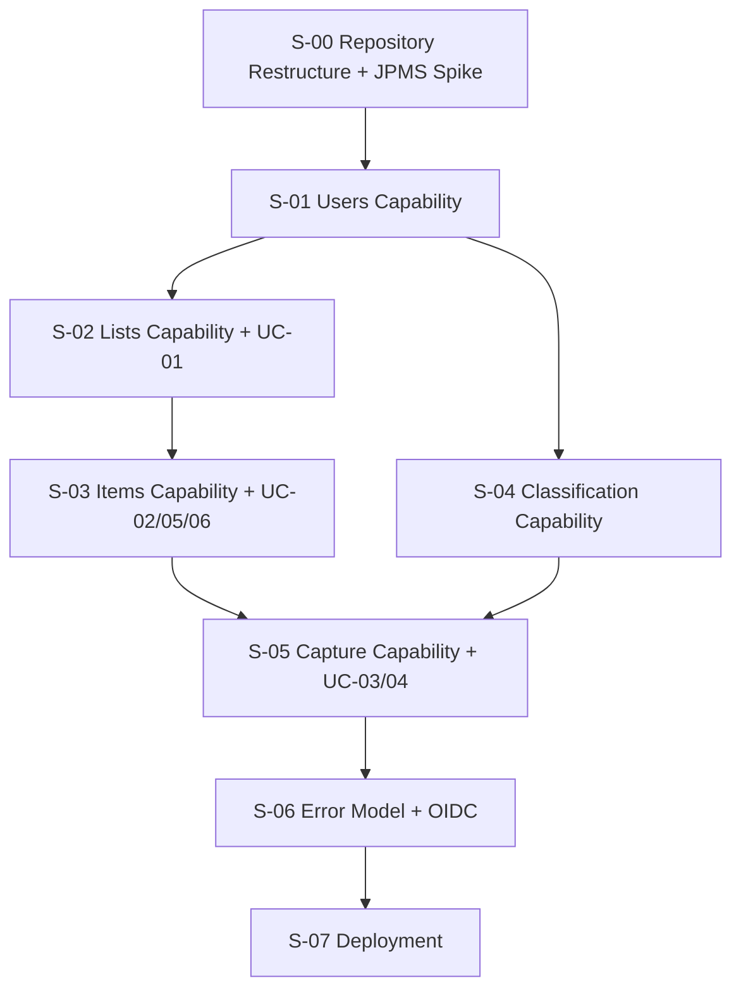

# CAPSA-PLAN-001 — Engineering Plan: Capsa v0.1

**Role:** product-architect (CAPSA-PLAN-001)
**Status:** Draft — REVIEW
**Input authority:** reconciled architecture (CAPSA-ARCH-RECONCILE-001), UC-01–UC-06, CAPSA-QA-001

---

## 1. Goal

Capsa v0.1 is complete when a single authenticated User can:

1. Create semantic Lists with names and optional purposes (UC-01)
2. Add Items directly to a known List (UC-02)
3. Submit raw text captures that are automatically classified into a List, using prior User-confirmed evidence (UC-03, Known strategy)
4. Resolve ambiguous classifications by selecting a List; have that decision preserved as future classification evidence (UC-04)
5. View a List and its pending Items (UC-05)
6. Mark a pending Item as completed, preserving history (UC-06)

The system runs on a single-node VPS, deployed as a Docker container backed by PostgreSQL. JPMS module boundaries enforce architectural rules at compile time. No external AI provider is required for v0.1 — the Known Classification strategy (exact match on prior User-confirmed evidence) is sufficient.

---

## 2. Inputs

| Artifact | Status |
|---|---|
| Product intent (`intent1.md`) | Final |
| UC-01 through UC-06 | Final |
| Reconciled domain model v0.1 | Final |
| Reconciled architecture v0.1 (CAPSA-ARCH-RECONCILE-001) | Final |
| Acceptance test cases CAPSA-QA-001 (43 TCs) | Final |
| Current repository: single Quarkus 3.39.2 scaffold, Java 25, single-module | Starting state |

---

## 3. Architectural Constraints

All slices must preserve:

| Constraint | Enforcer |
|---|---|
| Maven multi-module; one Maven module = one JPMS module | Module structure |
| JPMS: `internal` packages never exported | `module-info.java` |
| Cross-capability collaboration through public services only | JPMS + architecture review |
| No capability accesses another's repository | JPMS unexported `internal.persistence` |
| `capsa.runtime` is the only Quarkus module | Maven packaging |
| Capabilities do not depend on `capsa.runtime` | Module `requires` declarations |
| `UserId` is a strongly typed public concept from `capsa.users.api` | Type discipline |
| `CurrentUser` interface owned by `capsa.users.api` | Type discipline |
| Consumers depend on `Classifier`, not `ClassificationPipeline` | JPMS encapsulation |
| No DB transaction spans external provider calls | Transaction discipline |
| `Item.captureId` UNIQUE constraint + idempotent resolution | Persistence + service |
| UC-05 uses two endpoints (Option C); `lists` does not depend on `items` | Module graph |
| Jakarta JSON-B, not Jackson | Dependency discipline |
| Per-capability exceptions; no shared `CapsaException` | Code discipline |
| API keys from env/secrets; never in source or logs | Security discipline |

---

## 4. Implementation Strategy

### Current state

The repository is a single-module Quarkus scaffold:
- One Maven module, root `pom.xml` with `<packaging>quarkus</packaging>`
- `src/main/java/com/capsa/GreetingResource.java` (scaffold only)
- No domain, no capabilities, no JPMS, no persistence

### Strategy

**Vertical slices, behavior-first.** Infrastructure is introduced when a behavior requires it — not preemptively.

The ordering follows the capability dependency graph and maximizes observable behavior early:

```
S-00  Repository Restructure + Quarkus+JPMS Spike  →  application boots
S-01  Users Capability                              →  identity + auth context
S-02  Lists Capability + UC-01                     →  first observable behavior
S-03  Items Capability + UC-02 + UC-05 + UC-06     →  4 of 6 use cases working
S-04  Classification Capability (Known Strategy)   →  Classifier wired
S-05  Capture Capability + UC-03 + UC-04           →  all 6 use cases working
S-06  Error Model + OIDC Hardening                 →  production-ready error handling
S-07  Deployment                                   →  running on VPS
```

After **S-03**, a User can create Lists, add Items directly, view them, and complete them. Four of six use cases work with full tests.

After **S-05**, all six use cases work end-to-end, including smart capture with Known Classification.

### Why this order

- **S-00 first:** Quarkus + Maven multi-module + JPMS is the highest technical risk. Validate the skeleton before building anything on it.
- **S-01 before S-02:** `UserId` and `CurrentUser` are required by all capability REST resources.
- **S-02 before S-03:** `items` depends on `lists` for access verification.
- **S-04 can start after S-01:** `classification` depends only on `users`. Could be parallelized with S-02/S-03 in a team; in sequential work, fits naturally between S-03 and S-05.
- **S-05 last among features:** requires all other capabilities. Contains the most complexity (two-transaction flow, idempotency, failure handling).
- **S-06 after features:** Error hardening is a cross-cutting concern best done once behavior is complete.
- **S-07 last:** Deployment is intentionally the final concern for v0.1.

---

## 5. Slice Dependency Graph



The graph is acyclic. S-04 can start as soon as S-01 completes.

---

## 6. Slice Definitions

---

### S-00 — Repository Restructure + Quarkus+JPMS Validation Spike

**Goal:** Convert the single-module scaffold to the Maven multi-module JPMS structure. Prove that Quarkus boots, CDI works across module boundaries, JPMS encapsulation is effective, and Jakarta REST resources are discovered.

**Why now:** This is the highest-risk architectural question for Capsa. Quarkus + Maven multi-module + JPMS is a specific configuration that must be proven before building capability logic on top of it. Discovering a blocking incompatibility after five slices of capability work would be expensive.

**Depends on:** nothing

**Use Cases:** none (infrastructure)

**Acceptance Test Cases:** none

**Scope:**
- Convert root `pom.xml` to `<packaging>pom</packaging>` with 6 child `<module>` entries
- Create `capsa-users/`, `capsa-lists/`, `capsa-items/`, `capsa-capture/`, `capsa-classification/`, `capsa-runtime/` Maven modules
- Each module gets a `pom.xml` (plain `jar` except `capsa-runtime`)
- Each module gets a `src/main/java/module-info.java` declaring the module name and initial `requires`/`exports`
- `capsa-runtime`: inherits current Quarkus configuration; has `<packaging>quarkus</packaging>`; provides a minimal health/status endpoint to prove REST + CDI boot
- All capability modules: empty `api/` package (placeholder record/interface) to prove JPMS exports work
- Move `GreetingResource.java` to `capsa-runtime` temporarily; replace with a health check once Quarkus health is configured; or remove entirely
- Add `quarkus-smallrye-health` to `capsa-runtime` as the smoke-test endpoint

**Out of scope:**
- No domain objects, no persistence, no OIDC, no use cases

**Modules touched:** all 6

**Public API changes:** none (skeleton only)

**Persistence changes:** none

**Transaction behavior:** none

**Tests required:**
- `./mvnw test` passes (runtime module compiles and boots)
- `./mvnw quarkus:dev` starts successfully
- Health endpoint `GET /q/health/live` returns 200
- JPMS structure: capability `internal` package is inaccessible from another capability (enforced by compiler; confirmed by attempting a cross-module internal import in a test that must fail to compile)

**Completion evidence:**
- `./mvnw package` builds successfully across all 6 modules
- Application starts (`./mvnw quarkus:dev`)
- `GET /q/health/live` → `{"status":"UP"}`
- No capability module has `requires capsa.runtime` in its `module-info.java`
- Module dependency graph in `module-info.java` files matches the reconciled architecture graph

**Risks / notes:**
- Quarkus ArC (CDI) build-time scanning may need explicit configuration for beans in JPMS modules. The Quarkus Jandex index must cover all capability modules. `quarkus-maven-plugin` in `capsa-runtime` needs to see all capability JARs on its classpath for index building. May require `@IndexDependency` annotation or explicit Jandex configuration.
- Hibernate ORM with JPMS may need `opens` directives for Hibernate's reflection. Defer until S-01 when persistence is first introduced.
- JPMS `--add-opens` JVM arguments may be required for certain Jakarta providers. The Quarkus build-time AOT model reduces this risk significantly for native builds.

---

### S-01 — Users Capability

**Goal:** Capsa User identity, provisioning, and the `CurrentUser`/`UserId` public API. All other capability modules depend on this.

**Why now:** `UserId` and `CurrentUser` are required by the REST resources of every other capability. They must exist before any REST endpoint can compile.

**Depends on:** S-00

**Use Cases:** none directly (identity infrastructure for all UCs)

**Acceptance Test Cases:** none directly (identity is a precondition for all TCs)

**Scope:**

`capsa.users.api`:
- `UserId` — `public record UserId(UUID value) {}`
- `CurrentUser` — `public interface CurrentUser { UserId userId(); }`
- `UserService` — `findOrProvision(oidcSubject, email, name)`, `findById(UserId)`
- `UserView` — `userId`, `email`, `name`

`capsa.users.internal`:
- `User` domain object (no JPA, no CDI)
- `UserEntity` (`@Entity`, `@Table("users")`)
- `UserRepository` (EntityManager-based; `findByOidcSubject`, `save`)
- `UserConverter` (`toDomain`, `toEntity`)
- `UserServiceImpl` implements `UserService`

`capsa.runtime`:
- `OidcCurrentUser implements CurrentUser` — `@RequestScoped`; injects `JsonWebToken`; calls `UserService.findOrProvision()`
- Quarkus dependency additions: `quarkus-oidc`, `quarkus-hibernate-orm`, `quarkus-jdbc-postgresql`, `quarkus-flyway`
- Flyway: `V001__users_initial.sql`

Dev/test OIDC:
- Use `quarkus-test-security` (`io.quarkus:quarkus-test-security`) for `@TestSecurity` in tests — no real JWT required
- Dev mode: Quarkus DevServices spins up a PostgreSQL container automatically (no local install needed for `./mvnw quarkus:dev`)
- `application.properties` uses `%test` profile for Testcontainers

**Out of scope:**
- No REST endpoint for users (no UC requires exposing user data directly)
- No password/credential storage
- Real OIDC provider configuration deferred to S-06

**Modules touched:** `capsa-users`, `capsa-runtime`

**Public API changes:**
- `capsa.users.api` newly exports: `UserId`, `CurrentUser`, `UserService`, `UserView`

**Persistence changes:**
- Flyway `V001__users_initial.sql`:
  ```sql
  CREATE TABLE users (
      id          UUID PRIMARY KEY DEFAULT gen_random_uuid(),
      oidc_subject VARCHAR(255) NOT NULL UNIQUE,
      email       VARCHAR(255) NOT NULL,
      name        VARCHAR(255),
      created_at  TIMESTAMPTZ NOT NULL DEFAULT now()
  );
  ```

**Transaction behavior:**
- `UserService.findOrProvision()` is `@Transactional`; idempotent (upsert semantics)

**Tests required:**
- Unit: `User` domain invariants
- Service (mock repo): `findOrProvision` idempotency, `findById` not-found case
- PostgreSQL integration (`@QuarkusTest` + Testcontainers): `findOrProvision` creates user on first call, returns existing on repeat call; `findById` retrieves correctly
- Verify `UserEntity` is not accessible from `capsa-lists` (JPMS check: attempted import fails to compile)

**Completion evidence:**
- `UserService.findOrProvision()` creates a User row in PostgreSQL
- `UserService.findById()` retrieves it
- `UserId` and `CurrentUser` are importable from `capsa-lists` (exports working)
- `UserEntity` is NOT importable from `capsa-lists` (JPMS encapsulation working)
- `OidcCurrentUser` compiles in `capsa-runtime` without any capability module depending on `runtime`

**Risks / notes:**
- Hibernate/JPA + JPMS: `UserEntity` needs to be accessible to Hibernate's reflection. With Quarkus's build-time processing, the entity is pre-analyzed at compile time; `opens` directives are typically not needed in native mode. JVM mode may require `opens com.capsa.users.internal.persistence.entity to org.hibernate.orm.core;` in `module-info.java`. Document required `opens` for JVM mode.
- DevServices PostgreSQL (Quarkus's built-in Testcontainers) should work without configuration; validate in this slice.

---

### S-02 — Lists Capability + UC-01

**Goal:** First observable Capsa behavior. A User creates a semantic List.

**Why now:** `lists` is the foundation for Items (S-03) and classification candidates (S-05). UC-01 provides the first end-to-end test of the full stack: REST → service → persistence → response.

**Depends on:** S-01

**Use Cases:** UC-01

**Acceptance Test Cases:** TC-UC01-001, TC-UC01-002, TC-UC01-003, TC-UC01-004, TC-UC01-005

**Scope:**

`capsa.lists.api`:
- `ListId` — `public record ListId(UUID value) {}`
- `ListView` — `listId`, `name`, `purpose` (nullable), `ownerId` (UserId)
- `CreateListCommand` — `name`, `purpose` (nullable)
- `ListService` — `create(UserId, CreateListCommand)`, `getById(UserId, ListId)`, `getByUser(UserId)`, `verifyContributionAccess(UserId, ListId)`

`capsa.lists.internal`:
- `List` domain object — invariants: name non-blank; `ownerId` non-null
- `ListEntity`, `ListRepository`, `ListConverter`
- `ListServiceImpl` — enforces invariants, ownership
- `ListResource` — `POST /capsa/api/lists`, `GET /capsa/api/lists/{id}`

`capsa.runtime`:
- Flyway: `V002__lists_initial.sql`

**Out of scope:**
- `getByUser` is implemented but no REST endpoint for it (used internally by capture later)
- Inferred purpose (not a v0.1 requirement)
- Duplicate List name policy (not defined — no uniqueness enforced; open question)

**Modules touched:** `capsa-lists`, `capsa-runtime`

**Public API changes:**
- `capsa.lists.api` newly exports: `ListId`, `ListView`, `CreateListCommand`, `ListService`

**Persistence changes:**
- Flyway `V002__lists_initial.sql`:
  ```sql
  CREATE TABLE lists (
      id          UUID PRIMARY KEY DEFAULT gen_random_uuid(),
      owner_id    UUID NOT NULL REFERENCES users(id),
      name        VARCHAR(500) NOT NULL,
      purpose     TEXT,
      created_at  TIMESTAMPTZ NOT NULL DEFAULT now()
  );
  CREATE INDEX idx_lists_owner_id ON lists(owner_id);
  ```

**Transaction behavior:**
- `ListServiceImpl.create()` — `@Transactional`
- `ListServiceImpl.getById()`, `getByUser()` — read-only; `@Transactional(READ_ONLY)`
- `ListServiceImpl.verifyContributionAccess()` — read-only; throws if not authorized

**Tests required:**
- Unit: `List` domain invariants (blank name rejected, ownerId enforced)
- Service (mock): `create`, `getById`, `verifyContributionAccess` authorization check
- PostgreSQL integration: `create` persists correctly; `getByUser` returns only this User's Lists
- Quarkus integration (`@QuarkusTest` + `@TestSecurity`): `POST /capsa/api/lists` → 201 + ListView
- Karate:
  - `TC-UC01-001`: create list with name + purpose → 201
  - `TC-UC01-002`: create list without purpose → 201
  - `TC-UC01-003`: blank name → 422/400 validation error
  - `TC-UC01-004`: non-existent owner → not applicable (owner is authenticated user — test: unauthenticated → 401)
  - `TC-UC01-005`: User A's list not returned when User B queries

**Completion evidence:**
- `POST /capsa/api/lists` with valid auth and name → `201 Created` with List id, name, purpose, ownerId
- `POST /capsa/api/lists` with blank name → validation error
- `GET /capsa/api/lists/{id}` returns the List for its owner
- `GET /capsa/api/lists/{id}` returns 403/404 for another User's List
- Unauthenticated request → 401
- All 5 UC-01 acceptance test cases have corresponding automated tests

**Risks / notes:**
- `TC-UC01-004` tests "non-existent owner" but the owner IS the authenticated user — the precondition failure maps to invalid authentication, not a separate owner ID input. Record this traceability nuance.
- JPMS: `ListResource` injects `CurrentUser` from `capsa.users.api` — confirm `capsa.lists` `module-info.java` declares `requires capsa.users`. First real test of cross-module CDI injection.

---

### S-03 — Items Capability + UC-02 + UC-05 + UC-06

**Goal:** Direct Item management. After this slice, four of six use cases are fully working with tests.

**Why now:** `items` is needed by S-05 (capture) and also enables immediate user value (add, view, complete items directly). UC-05 (View List) is achievable via two endpoints — lists endpoint from S-02, items endpoint here.

**Depends on:** S-02 (for `lists` public API + verifyContributionAccess)

**Use Cases:** UC-02, UC-05, UC-06

**Acceptance Test Cases:**
- TC-UC02-001 through TC-UC02-007
- TC-UC05-001 through TC-UC05-007
- TC-UC06-001 through TC-UC06-008

**Scope:**

`capsa.items.api`:
- `ItemId` — `public record ItemId(UUID value) {}`
- `ItemView` — `itemId`, `listId` (UUID), `captureId` (UUID, nullable), `name`, `notes` (nullable), `status` (String "PENDING"|"DONE"), `createdAt`, `completedAt` (nullable)
- `ItemService` — `create(UserId, ListId, name, notes)`, `createFromCapture(UserId, ListId, CaptureId, name, notes)`, `complete(UserId, ItemId)`, `getByList(UserId, ListId, ItemStatusFilter)`
- `CreateItemCommand` — `listId`, `name`, `notes`
- `ItemStatusFilter` — enum: `ACTIVE`, `HISTORY`, `ALL`

`capsa.items.internal`:
- `Item` domain object — `ItemStatus` enum (PENDING, DONE); invariants: `completedAt != null iff status == DONE`
- `ItemEntity`, `ItemRepository`, `ItemConverter`
- `ItemServiceImpl` — enforces invariants, calls `ListService.verifyContributionAccess()`
- `ItemResource` — `POST /capsa/api/items`, `GET /capsa/api/items?listId=`, `PATCH /capsa/api/items/{id}` (or `POST /capsa/api/items/{id}/completion`)

`capsa.runtime`:
- Flyway: `V003__items_initial.sql`

**Key persistence detail:** `capture_id` column is nullable UUID with a UNIQUE constraint. Rows where `capture_id IS NULL` are excluded from the uniqueness check (allows multiple items without a capture). Only `capture_id IS NOT NULL` values must be unique.

**Out of scope:**
- No ON_HOLD, ARCHIVED states
- No pagination, filtering, search, configurable sort
- No PatternDetector

**Modules touched:** `capsa-items`, `capsa-runtime`

**Public API changes:**
- `capsa.items.api` newly exports: `ItemId`, `ItemView`, `ItemService`, `CreateItemCommand`, `ItemStatusFilter`

**Persistence changes:**
- Flyway `V003__items_initial.sql`:
  ```sql
  CREATE TABLE items (
      id          UUID PRIMARY KEY DEFAULT gen_random_uuid(),
      list_id     UUID NOT NULL REFERENCES lists(id),
      capture_id  UUID,
      name        VARCHAR(1000) NOT NULL,
      notes       TEXT,
      status      VARCHAR(20) NOT NULL DEFAULT 'PENDING',
      created_at  TIMESTAMPTZ NOT NULL DEFAULT now(),
      completed_at TIMESTAMPTZ,
      CONSTRAINT uq_items_capture_id UNIQUE (capture_id)
  );
  CREATE INDEX idx_items_list_id ON items(list_id);
  CREATE INDEX idx_items_list_status ON items(list_id, status);
  ```
  Note: PostgreSQL UNIQUE constraint excludes NULL values automatically — rows with `capture_id IS NULL` do not conflict.

**Transaction behavior:**
- `ItemServiceImpl.create()` — `@Transactional`
- `ItemServiceImpl.createFromCapture()` — `@Transactional`; called from CaptureResolutionService's transaction (JOIN)
- `ItemServiceImpl.complete()` — `@Transactional`
- `ItemServiceImpl.getByList()` — read-only

**Tests required:**
- Unit: `Item` lifecycle (PENDING → DONE invariants, completedAt, new occurrence semantics)
- Service (mock): create, complete, getByList filtering, ownership enforcement
- PostgreSQL integration:
  - `uq_items_capture_id` constraint: attempting to insert two Items with the same `capture_id` throws `ConstraintViolationException`
  - Completing an item sets `completedAt`; item still exists in table
  - `getByList(ACTIVE)` returns only PENDING; `getByList(HISTORY)` returns only DONE
- Quarkus integration: REST endpoints, `@TestSecurity`, auth enforcement
- Karate: all TC-UC02, TC-UC05, TC-UC06 test cases

**Completion evidence:**
- `POST /capsa/api/items` creates PENDING Item
- `PATCH /capsa/api/items/{id}` (or completion endpoint) transitions to DONE with completedAt set
- `GET /capsa/api/items?listId={id}` (ACTIVE) excludes DONE Items
- `GET /capsa/api/items?listId={id}&status=history` includes DONE Items
- DONE Item still exists in DB (not deleted)
- New occurrence created when adding item with same name as historical
- `capture_id` UNIQUE constraint proven via integration test
- Unauthorized access rejected
- All 22 acceptance test cases (UC-02 + UC-05 + UC-06) have corresponding automated tests

**Risks / notes:**
- PostgreSQL UNIQUE constraint on nullable `capture_id`: standard PostgreSQL behavior allows multiple NULLs in a UNIQUE column (NULL ≠ NULL). This is correct behavior — Items created directly (without a Capture) set `capture_id = NULL`.
- Item idempotency is only partially tested here; the full test (concurrent/retry resolution) requires S-05.

---

### S-04 — Classification Capability (Known Strategy)

**Goal:** The `Classifier` interface is wired and operational. Known Classification (exact match on User-scoped prior evidence) works. Classification is fully encapsulated behind the `Classifier` interface.

**Why now:** Required by S-05 (Capture). Can start after S-01 since `classification` only depends on `users`. In sequential ordering, fits naturally after S-03.

**Depends on:** S-01 (for `UserId`)

**Use Cases:** none directly; enables UC-03/UC-04 in S-05

**Acceptance Test Cases:**
- TC-UC03-005 (Known Classification resolves a new Capture)
- TC-UC03-006 (User isolation in classification evidence)

**Scope:**

`capsa.classification.api`:
- `Classifier` — interface: `classify(ClassificationRequest)`, `recordUserResolution(UserId, String, UUID)`
- `ClassificationRequest` — `UserId`, `normalizedContent` (String), `candidates` (List\<ClassificationTarget\>)
- `ClassificationResult` — `outcome` (CLASSIFIED | NEEDS_RESOLUTION), `candidates` (List\<ClassificationCandidate\>), `selectedListId` (UUID, nullable), `metadata` (Map\<String,String\>, nullable)
- `ClassificationCandidate` — `listId` (UUID), `confidence` (double), `explanation` (String)
- `ClassificationTarget` — `listId` (UUID), `name` (String), `explicitPurpose` (String, nullable)

`capsa.classification.internal`:
- `ClassificationStrategy` — private interface: `ClassificationResult classify(ClassificationRequest)`
- `ClassificationPipeline` — private: executes ordered strategies; propagates execution exceptions; terminates on CLASSIFIED
- `DefaultClassifier` — private: implements `Classifier`; v0.1 pipeline = `[KnownClassificationStrategy]`
- `KnownClassificationStrategy` — private: queries `ClassificationMemory` by `userId + normalizedContent`; returns CLASSIFIED (first USER_CONFIRMED match) or NEEDS_RESOLUTION
- `ClassificationMemoryEntry` domain object — `userId`, `normalizedContent`, `selectedListId`, `source` (AUTO | USER_CONFIRMED), `recordedAt`
- `ClassificationMemoryEntryEntity`, `ClassificationMemoryEntryRepository`, `ClassificationMemoryEntryConverter`
- `ClassificationMemoryImpl` — `record(entry)`, `findLatestUserConfirmed(userId, normalizedContent)`

`capsa.runtime`:
- Flyway: `V004__classification_memory_initial.sql`
- No CDI producer needed; `DefaultClassifier` is self-contained with `@ApplicationScoped`

**Out of scope:**
- `EmbeddingClassificationStrategy` — seam reserved; not implemented
- `SystemOneClassificationStrategy` — seam reserved; not implemented
- ONNX, pgvector — not required
- No REST resource (classification is called by capture internally)

**Modules touched:** `capsa-classification`, `capsa-runtime`

**Public API changes:**
- `capsa.classification.api` newly exports: `Classifier`, `ClassificationRequest`, `ClassificationResult`, `ClassificationCandidate`, `ClassificationTarget`

**Persistence changes:**
- Flyway `V004__classification_memory_initial.sql`:
  ```sql
  CREATE TABLE classification_memory_entries (
      id                UUID PRIMARY KEY DEFAULT gen_random_uuid(),
      user_id           UUID NOT NULL REFERENCES users(id),
      normalized_content TEXT NOT NULL,
      selected_list_id  UUID NOT NULL,
      source            VARCHAR(20) NOT NULL,
      recorded_at       TIMESTAMPTZ NOT NULL DEFAULT now()
  );
  CREATE INDEX idx_cme_user_normalized ON classification_memory_entries(user_id, normalized_content);
  CREATE INDEX idx_cme_user_source ON classification_memory_entries(user_id, source);
  ```

**Transaction behavior:**
- `DefaultClassifier.classify()` — not `@Transactional` itself; `KnownClassificationStrategy` reads memory (read-only query, participates in caller's transaction or none)
- `DefaultClassifier.recordUserResolution()` — `@Transactional`; inserts a `ClassificationMemoryEntry`

**Tests required:**
- Unit: `KnownClassificationStrategy` — match found → CLASSIFIED; no match → NEEDS_RESOLUTION
- Unit: `ClassificationPipeline` — CLASSIFIED terminates; NEEDS_RESOLUTION after all strategies; execution exception propagates (not converted to NEEDS_RESOLUTION)
- Unit: `DefaultClassifier` — full flow
- PostgreSQL integration:
  - `recordUserResolution()` persists entry under correct userId
  - `classify()` after `recordUserResolution()` returns CLASSIFIED for same user and content
  - `classify()` for *different* user with same content returns NEEDS_RESOLUTION (TC-UC03-006)
  - Evidence is additive: multiple calls to `recordUserResolution()` with different selections coexist
- JPMS encapsulation test: attempt to import `ClassificationStrategy` or `DefaultClassifier` from `capsa-capture` — must fail at compile time

**Completion evidence:**
- `Classifier` bean injectable in `capsa-capture` (exported)
- `ClassificationStrategy` is NOT importable from `capsa-capture` (JPMS enforcement)
- Known Classification resolves a Capture after a prior `recordUserResolution()` for same user+content
- Different User's evidence does NOT affect current User's classification result
- Execution exception from a failing strategy propagates out of `classify()` without conversion to NEEDS_RESOLUTION

**Risks / notes:**
- `ClassificationStrategy` SPI visibility: it must be accessible within `capsa.classification.internal` but not exported. Strategies must be wired by `DefaultClassifier` internally, not injected via CDI from `runtime`. If Quarkus CDI build-time scanning discovers `KnownClassificationStrategy` and tries to inject it somewhere, ensure it stays internal.
- `DefaultClassifier` should be the CDI-injectable `@ApplicationScoped` bean satisfying the `Classifier` type. `capsa.classification.api` exports `Classifier`; `capsa.classification.internal.DefaultClassifier` is internal. CDI discovers `DefaultClassifier` as the implementation of `Classifier` at runtime — this works because CDI uses the public type for injection points.

---

### S-05 — Capture Capability + UC-03 + UC-04

**Goal:** Smart capture — submit raw text, classify using Known strategy, produce a PENDING Item or request resolution. Resolve ambiguity by selecting a List, preserving the decision as evidence. All six use cases are now working.

**Why now:** Requires all other capabilities. Contains the most complex transactional and idempotency logic. Benefits from having all dependency slices tested and stable.

**Depends on:** S-03 (items), S-04 (classification), and transitively S-01, S-02

**Use Cases:** UC-03, UC-04

**Acceptance Test Cases:** TC-UC03-001 through TC-UC03-007, TC-UC04-001 through TC-UC04-009

**Scope:**

`capsa.capture.api`:
- `CaptureId` — `public record CaptureId(UUID value) {}`
- `CaptureResult` — sealed interface: `Classified(ItemView item)` | `NeedsResolution(CaptureId captureId, List<ClassificationCandidate> candidates)`
- `CaptureService` — `submit(UserId, String content)`, `resolve(UserId, CaptureId, ListId)`
- `SubmitCaptureCommand` — `content`

`capsa.capture.internal`:

Domain:
- `Capture` — `captureId`, `userId`, `originalContent`, `normalizedContent`, `processingStatus` (RECEIVED | PROCESSING | CLASSIFIED | NEEDS_RESOLUTION | RESOLVED | FAILED), `capturedAt`
- `ClassificationAttempt` — `captureId`, `strategy`, `outcome`, `candidates`, `attemptedAt`
- `ClassificationResolution` — `captureId`, `selectedListId`, `resolvedBy` (USER), `resolvedAt`

Domain services / ports:
- `CaptureNormalizer` — deterministic: trim, lowercase, normalize Unicode whitespace; preserves original separately
- `CaptureInterpreter` port + v0.1 implementation: `ItemDraft(name=normalizedContent, notes=null)` — passthrough for v0.1; port preserved for future NLP interpretation

Orchestration:
- `CaptureOrchestrator` — NOT `@Transactional`; owns the two-phase flow:
  1. Calls `CaptureCreationService.createCapture()`
  2. Calls `Classifier.classify()` (outside any transaction)
  3. Calls `CaptureResolutionService.resolveCapture()` or `CaptureResolutionService.markFailed()`
- `CaptureCreationService` — `@Transactional` (TX-1): persists Capture + initial ClassificationAttempt; returns persisted `Capture`
- `CaptureResolutionService` — `@Transactional` (TX-2):
  - `resolveCapture()`: idempotency check (verify PROCESSING), calls `ItemService.createFromCapture()`, records evidence, updates status
  - `markFailed()`: sets `processingStatus = FAILED`
  - `resolveFromUser()` (UC-04): idempotency check (verify NEEDS_RESOLUTION), verifies access, creates Item, records ClassificationResolution, calls `Classifier.recordUserResolution()`, updates status

REST:
- `CaptureResource` — `POST /capsa/api/captures`, `POST /capsa/api/captures/{id}/resolution`

`capsa.runtime`:
- Flyway: `V005__captures_initial.sql`, `V006__classification_attempts_initial.sql`

**Out of scope:**
- `CaptureInterpreter` NLP implementation (v0.1 passthrough is sufficient)
- Retry policy for FAILED captures (deferred — QA Q-02)
- Embedding/SystemOne classification paths

**Modules touched:** `capsa-capture`, `capsa-runtime`

**Public API changes:**
- `capsa.capture.api` newly exports: `CaptureId`, `CaptureResult`, `CaptureService`, `SubmitCaptureCommand`

**Persistence changes:**
- Flyway `V005__captures_initial.sql`:
  ```sql
  CREATE TABLE captures (
      id                UUID PRIMARY KEY DEFAULT gen_random_uuid(),
      user_id           UUID NOT NULL REFERENCES users(id),
      original_content  TEXT NOT NULL,
      normalized_content TEXT NOT NULL,
      processing_status VARCHAR(30) NOT NULL DEFAULT 'RECEIVED',
      captured_at       TIMESTAMPTZ NOT NULL DEFAULT now()
  );
  CREATE INDEX idx_captures_user_id ON captures(user_id);
  ```
- Flyway `V006__classification_attempts_initial.sql`:
  ```sql
  CREATE TABLE classification_attempts (
      id          UUID PRIMARY KEY DEFAULT gen_random_uuid(),
      capture_id  UUID NOT NULL REFERENCES captures(id),
      outcome     VARCHAR(20),
      candidates  JSONB,
      attempted_at TIMESTAMPTZ NOT NULL DEFAULT now()
  );
  CREATE TABLE classification_resolutions (
      id              UUID PRIMARY KEY DEFAULT gen_random_uuid(),
      capture_id      UUID NOT NULL UNIQUE REFERENCES captures(id),
      selected_list_id UUID NOT NULL,
      resolved_by     VARCHAR(20) NOT NULL,
      resolved_at     TIMESTAMPTZ NOT NULL DEFAULT now()
  );
  ```
  Note: `UNIQUE` on `classification_resolutions.capture_id` — a Capture can have at most one resolution record.

**Transaction behavior:**

UC-03 flow:
```
CaptureOrchestrator (no TX)
    CaptureCreationService.createCapture()  @Transactional TX-1
        — persist Capture (PROCESSING)
        — persist ClassificationAttempt (PENDING)
        COMMIT

    Classifier.classify(request)  ← no DB transaction open
        — KnownClassificationStrategy reads ClassificationMemory (short read-only query)
        — execution exception → CaptureOrchestrator catches → FAILED path

    CaptureResolutionService.resolveCapture()  @Transactional TX-2
        — verify Capture.processingStatus == PROCESSING (idempotency)
        — ItemService.createFromCapture() — inserts Item with capture_id; UNIQUE constraint enforced
        — update ClassificationAttempt with outcome + candidates
        — update Capture.processingStatus (CLASSIFIED | NEEDS_RESOLUTION)
        COMMIT
```

UC-04 flow:
```
CaptureResolutionService.resolveFromUser()  @Transactional single TX
    — load Capture; verify NEEDS_RESOLUTION (idempotency)
    — verifyContributionAccess(userId, selectedListId)
    — ItemService.createFromCapture() — UNIQUE capture_id enforced
    — persist ClassificationResolution
    — Classifier.recordUserResolution() — inserts ClassificationMemoryEntry
    — update Capture.processingStatus (RESOLVED)
    COMMIT
```

**Tests required:**
- Unit: `CaptureNormalizer` (deterministic; original content preserved)
- Unit: `Capture` domain lifecycle transitions
- Service (mock): `CaptureOrchestrator` UC-03 flow, UC-04 flow, FAILED path
- PostgreSQL integration:
  - Known Classification: after `recordUserResolution`, same User's next capture classifies
  - User isolation: User B's capture not classified by User A's evidence (TC-UC03-006)
  - Duplicate protection: second `createFromCapture()` with same `captureId` → DB ConstraintViolationException (TC-UC03-007)
  - UC-04 idempotency: second resolution of same RESOLVED capture rejected (TC-UC04-003)
  - Original content preserved after normalization (TC-UC03-002)
  - FAILED path: execution exception → FAILED, not NEEDS_RESOLUTION (TC-UC03-004)
- Quarkus integration (`@TestSecurity`): REST endpoints
- Karate: all 16 TC-UC03 + TC-UC04 acceptance test cases

**Completion evidence:**
- `POST /capsa/api/captures` with no prior evidence → NEEDS_RESOLUTION response with candidates
- `POST /capsa/api/captures` after a prior resolution of identical normalized content → Classified → PENDING Item
- `POST /capsa/api/captures/{id}/resolution` → PENDING Item created; evidence recorded
- Same capture submitted twice → second call does not create a second Item
- Resolve same capture twice → second resolution rejected
- User A's evidence does not affect User B's classification
- Simulated execution failure → `processingStatus = FAILED` (not NEEDS_RESOLUTION)
- All 16 acceptance test cases (UC-03 + UC-04) have corresponding automated tests

**Risks / notes:**
- The two-transaction model has no distributed transaction; if the process crashes after TX-1 commits but before TX-2 completes, the Capture remains in PROCESSING state. A future recovery mechanism can query PROCESSING Captures older than a threshold. This is an open question (QA Q-02 FAILED retry policy). Document but do not implement.
- `CaptureInterpreter` v0.1 passthrough means `Item.name = normalizedContent`. If the content is long, names may need truncation. Add a `@Size` constraint on the command or truncate in the normalizer. Document the policy.
- `candidates` stored as JSONB in `classification_attempts` avoids schema complexity for v0.1. Acceptable for the Known-only strategy; can be structured if needed later.
- The `ClassificationMemory` read inside `classify()` happens with no encompassing DB transaction. For the Known strategy, this is a short, read-only query — acceptable. For future strategies that involve external calls, the no-transaction rule is already enforced.

---

### S-06 — Error Model + OIDC Hardening

**Goal:** Production-ready error responses and real OIDC wiring. The system is safe to deploy publicly.

**Why now:** Cross-cutting concern best done after all feature behavior is complete and stable.

**Depends on:** S-05

**Use Cases:** all (error paths for each)

**Acceptance Test Cases:** all error-path tests across TC-UC01–TC-UC06

**Scope:**

Per-capability exceptions:
- `capsa.users.api`: `UserNotFoundException` (or functional equivalent)
- `capsa.lists.api`: `ListNotFoundException`, `ListAccessDeniedException`, error code constants (e.g., `ListErrors.NOT_FOUND = "CAPSA_LIST_NOT_FOUND"`)
- `capsa.items.api`: `ItemNotFoundException`, `ItemAccessDeniedException`, `InvalidItemStateException`
- `capsa.capture.api`: `CaptureNotFoundException`, `CaptureNotAwaitingResolutionException`, `CaptureAlreadyResolvedException`
- `capsa.classification.api`: (no public exceptions needed; errors propagate as `ClassificationExecutionException` internally)

`capsa.runtime`:
- `ListExceptionMapper implements ExceptionMapper<ListNotFoundException>` etc.
- Standard error response body: `{ "code": "CAPSA_LIST_NOT_FOUND", "message": "List not found." }`
- Development profile: include `diagnostic` field in response
- Production profile: no stack trace
- All exceptions logged at `ERROR` with correlation ID (or request UUID)

Real OIDC:
- `application.properties` references OIDC issuer, client ID via env vars: `${CAPSA_OIDC_AUTH_SERVER_URL}`, `${CAPSA_OIDC_CLIENT_ID}`
- `OidcCurrentUser` validated against real JWT in production profile
- `@TestSecurity` remains the test mechanism (no change to tests)
- `quarkus-oidc` already added in S-01; this slice adds the production configuration

API key protection (providers are future, but the pattern is established):
- Confirm no API key references exist in committed `application.properties`
- Document: provider keys referenced as `${CAPSA_PROVIDER_KEY}` only

**Out of scope:**
- Rate limiting, circuit breakers (deferred until external providers activated)
- Audit logging database subsystem

**Modules touched:** all capability `api` packages (exception types), `capsa-runtime` (mappers, OIDC config)

**Tests required:**
- Quarkus integration: verify each capability's error paths return stable error codes and safe messages
- Verify no stack trace in production profile responses
- Verify OIDC validation rejects expired/invalid tokens

**Completion evidence:**
- `404` response for non-existent List includes `{"code":"CAPSA_LIST_NOT_FOUND","message":"..."}`
- `403` for unauthorized access includes `{"code":"CAPSA_ACCESS_DENIED","message":"..."}`
- `422` for validation failure includes field-level details
- Development profile response includes `diagnostic` field; production does not
- `application.properties` contains no hardcoded OIDC secrets or API keys
- `GET /q/health` reports UP

---

### S-07 — Deployment

**Goal:** Capsa v0.1 running on a VPS behind a reverse proxy, accessible over HTTPS.

**Why now:** Deployment is intentionally the last concern. All behavior is proven on the developer workstation before deployment infrastructure is introduced.

**Depends on:** S-06

**Use Cases:** all (deployment enables real usage)

**Acceptance Test Cases:** none new; existing tests pass against deployed environment

**Scope:**
- `docker-compose.yml` (development / local): `capsa` + `postgres`; env vars from `.env` file (not committed)
- `docker-compose.prod.yml` (production): references Docker secrets or env vars
- Dockerfile (JVM): Quarkus scaffold already provides one in `src/main/docker/Dockerfile.jvm`; update for multi-module build
- Flyway runs automatically on startup (`quarkus.flyway.migrate-at-start=true`)
- Health endpoints: `/q/health/live` (liveness), `/q/health/ready` (readiness including DB check)
- Environment variable inventory: all required env vars documented (`CAPSA_DB_URL`, `CAPSA_DB_PASSWORD`, `CAPSA_OIDC_AUTH_SERVER_URL`, `CAPSA_OIDC_CLIENT_ID`)
- Quarkus Native build attempt: `./mvnw package -Dnative -Dquarkus.native.container-build=true`
- Reverse proxy: not included (Caddy or nginx — operator concern); document expected upstream URL

**Out of scope:**
- Kubernetes
- Redis / distributed cache
- TLS termination in Capsa (belongs to reverse proxy)
- CDN

**Modules touched:** `capsa-runtime` (Dockerfile, compose files, deployment docs)

**Tests required:**
- Docker Compose smoke: application starts, health check passes
- Smoke test against composed stack: `POST /capsa/api/lists` succeeds end-to-end
- Native build test: `./mvnw package -Dnative -Dquarkus.native.container-build=true` builds successfully

**Completion evidence:**
- `docker compose up` starts Capsa + PostgreSQL
- `GET /q/health/ready` → `{"status":"UP"}` including database check
- End-to-end flow (create list → add item → view list → complete item) works against Docker deployment
- Native image boots in < 1 second (Quarkus native startup time)
- No secrets committed to source control

**Risks / notes:**
- Quarkus Native + JPMS: native compilation with JPMS modules generally works but may require additional `--initialize-at-build-time` or reflection configuration for specific classes (particularly Hibernate/CDI internals). Document any required GraalVM configuration additions to `reflect-config.json` or Quarkus native hints.
- Multi-module Docker build: the native `container-build` flag uses a Docker container to run GraalVM; it needs access to all built JARs. Ensure the Maven build order is correct and all capability JARs are available before `capsa-runtime` builds its native image.

---

## 7. Testing Plan

Test levels accumulate across slices:

| Slice | Domain Unit | Service (mock) | PostgreSQL Integration | Quarkus Integration | Karate |
|---|---|---|---|---|---|
| S-00 | — | — | — | Boot smoke | — |
| S-01 | User domain | UserService | User persistence | — | — |
| S-02 | List domain | ListService | List persistence | ListResource | UC-01 |
| S-03 | Item domain | ItemService | Item persistence + UNIQUE | ItemResource | UC-02/05/06 |
| S-04 | Classification | DefaultClassifier | Memory persistence, isolation | — | — |
| S-05 | Capture domain | CaptureOrchestrator | TX flow, idempotency | CaptureResource | UC-03/04 |
| S-06 | — | — | — | Error codes, OIDC | Error paths |
| S-07 | — | — | — | Docker smoke | Deployed smoke |

### Test counts (estimated)

| Level | Tests |
|---|---|
| Domain unit | ~30 (invariants, lifecycle, normalizer) |
| Service (mock) | ~25 (use case flows, error paths) |
| PostgreSQL integration | ~20 (constraints, persistence queries, isolation) |
| Quarkus integration | ~20 (REST, auth, CDI wiring) |
| Karate | ~43 (aligned with acceptance test cases) + error paths |

---

## 8. Migration Plan

Flyway migrations enter one per data-model introduction:

| Migration | Slice | Content |
|---|---|---|
| `V001__users_initial.sql` | S-01 | `users` table |
| `V002__lists_initial.sql` | S-02 | `lists` table, owner FK |
| `V003__items_initial.sql` | S-03 | `items` table, UNIQUE `capture_id` |
| `V004__classification_memory_initial.sql` | S-04 | `classification_memory_entries` table |
| `V005__captures_initial.sql` | S-05 | `captures` table |
| `V006__classification_attempts_initial.sql` | S-05 | `classification_attempts`, `classification_resolutions` tables |

All files reside in `capsa-runtime/src/main/resources/db/migration/`.

Migrations run automatically on startup via `quarkus.flyway.migrate-at-start=true`.

No migration modifies another migration's schema. New schema changes introduce a new `V00n__` file.

---

## 9. Runtime / Configuration Plan

| Concern | Slice | Detail |
|---|---|---|
| Quarkus multi-module parent POM | S-00 | Convert root; create child modules |
| Quarkus DevServices (PostgreSQL) | S-01 | Auto-starts for `./mvnw quarkus:dev` |
| `quarkus-oidc` dependency | S-01 | Dev mode uses `@TestSecurity`; real OIDC configured in S-06 |
| `quarkus-hibernate-orm`, `quarkus-jdbc-postgresql` | S-01 | Persistence foundation |
| `quarkus-flyway` | S-01 | Migrations from S-01 onward |
| `quarkus-smallrye-health` | S-00 | Boot smoke test |
| `quarkus-test-security` | S-02 | `@TestSecurity` for all REST tests |
| OIDC production env vars | S-06 | `CAPSA_OIDC_AUTH_SERVER_URL`, `CAPSA_OIDC_CLIENT_ID` |
| Exception mappers | S-06 | Per-capability mappers in `capsa-runtime` |
| Quarkus Cache / Caffeine | Not on critical path | Add if `getByUser()` performance becomes an issue in S-05+ |
| Native build | S-07 | `./mvnw package -Dnative -Dquarkus.native.container-build=true` |

---

## 10. Deployment Slice

See S-07. Summary:

- **Runtime target:** JVM Docker image initially; native image validated
- **Compose:** `capsa` + `postgres` containers
- **Environment:** all sensitive values via OS environment variables (not in source)
- **Health:** `/q/health/live` and `/q/health/ready`
- **TLS:** reverse proxy (Caddy or nginx); Capsa listens on HTTP internally
- **Kubernetes:** explicitly excluded

---

## 11. Traceability Matrix

| Use Case | Acceptance Tests | Slice(s) |
|---|---|---|
| UC-01 — Create List | TC-UC01-001, 002, 003, 004, 005 | S-02 |
| UC-02 — Add Item to List | TC-UC02-001, 002, 003, 004, 005, 006, 007 | S-03 |
| UC-03 — Automatically Classify Capture | TC-UC03-001, 002, 003, 004, 005, 006, 007 | S-04 (005, 006 partially), S-05 (all) |
| UC-04 — Resolve Ambiguous Classification | TC-UC04-001, 002, 003, 004, 005, 006, 007, 008, 009 | S-05 |
| UC-05 — View List | TC-UC05-001, 002, 003, 004, 005, 006, 007 | S-03 |
| UC-06 — Complete Item | TC-UC06-001, 002, 003, 004, 005, 006, 007, 008 | S-03 |

**All 43 acceptance test cases map to implementation work. No gaps.**

### Domain Invariant Coverage by Slice

| Invariant | Test Cases | Slice |
|---|---|---|
| Resolved Capture → at most one Item | TC-UC03-007, TC-UC04-003 | S-05 |
| Classification uncertainty ≠ execution failure | TC-UC03-003, TC-UC03-004 | S-05 |
| ClassificationMemory User-scoped | TC-UC03-006, TC-UC04-008/009 | S-04, S-05 |
| `completedAt != null iff DONE` | TC-UC06-003 | S-03 |
| Completion does not delete Item | TC-UC06-002 | S-03 |
| Authorization is application policy | Multiple | S-02, S-03, S-05 |

---

## 12. Deferred Work

Explicitly excluded from v0.1. Seams are preserved; no implementation required.

| Feature / Technology | Why Deferred |
|---|---|
| ONNX embeddings + EmbeddingClassificationStrategy | No evidence Known strategy is insufficient |
| pgvector semantic profiles | Requires ONNX strategy to be meaningful |
| Jev / DeepSeek / SystemOneClassificationStrategy | No evidence needed for v0.1 single-user usage |
| Argonaut / LangChain4j | Same |
| Rate/cost protection for external providers | Only relevant when external providers are activated |
| Circuit breaker / retry (Quarkus Fault Tolerance) | Same |
| ClassificationMemory curation | No observable quality problem at v0.1 scale |
| PatternDetector | Future: history is preserved in `completedAt`, no implementation needed now |
| MCP adapter (`capsa-mcp` module) | Future: depends on `capture.api` and `lists.api` (seam already exists) |
| Shared Lists / multi-user collaboration | v0.2 |
| Geolocation / context awareness | v0.1.5 |
| Push notifications | Future |
| ON_HOLD, ARCHIVED, CANCELLED item states | Future: `ItemStatus` enum is internal, easy to extend |
| Inferred List purpose | Open product question (UC-01 §Open Questions) |
| Duplicate List name policy | Open product question (UC-01 §Open Questions) |
| FAILED Capture retry policy | Open product question (CAPSA-QA-001 Q-02) |
| Pagination, filtering, search | UC-05 explicitly defers these |
| Kubernetes | Explicitly out of scope for v0.1 VPS deployment |
| Redis / distributed cache | Single-node v0.1; not needed |
| OpenTelemetry | Log-based observability sufficient for v0.1 |

---

## 13. Risks

| Risk | Severity | Slice | Mitigation |
|---|---|---|---|
| Quarkus + Maven multi-module + JPMS integration fails or requires significant workarounds | HIGH | S-00 | Validate in the first slice; no capability logic built until proven |
| Quarkus ArC (CDI) build-time scanning does not discover beans in JPMS modules | HIGH | S-00, S-01 | May require explicit Jandex index configuration or `@IndexDependency`; validate in S-00 |
| Hibernate ORM + JPMS requires `opens` directives for JVM-mode reflection | MEDIUM | S-01 | Research and document required `opens` in `module-info.java`; native mode likely unaffected |
| JPMS `module-info.java` in non-exported packages prevents CDI injection of `DefaultClassifier` | MEDIUM | S-04 | CDI injects by the exported `Classifier` type; `DefaultClassifier` is the implementation; validate in S-04 |
| Two-transaction UC-03 flow leaves Captures in PROCESSING on process crash | MEDIUM | S-05 | Documented limitation; recovery mechanism is future work; PROCESSING Captures are observable for manual recovery |
| Native image compilation fails for some reflection-heavy path | MEDIUM | S-07 | JVM Docker image is the primary deployment artifact; native is a goal but not a blocker for v0.1 |
| `CaptureInterpreter` passthrough produces poor Item names from complex captures | LOW | S-05 | v0.1 known limitation; seam for NLP interpretation is in place for future upgrade |
| PostgreSQL UNIQUE on nullable `capture_id` — behavior misunderstood | LOW | S-03 | PostgreSQL standard: NULLs are excluded from unique constraint by default; validated in integration test |

---

## 14. Definition of Done

Capsa v0.1 is complete when:

1. **All 6 use cases pass automated tests:** UC-01 through UC-06 end-to-end via Karate, covering all 43 acceptance test cases
2. **All domain invariants are enforced and tested** (see §11 invariant coverage)
3. **JPMS boundaries are enforced at compile time:** attempting to import an `internal` type from another module fails with a compiler error
4. **Two-transaction UC-03 flow is correct:** PostgreSQL integration test proves no duplicate Items under repeated resolution attempts
5. **Classification isolation is proven:** User A's evidence does not affect User B (TC-UC03-006 passes)
6. **Error responses are stable:** each error path returns a consistent `code`+`message` structure; no stack traces in production profile
7. **Authentication is enforced:** all endpoints require a valid authenticated User; unauthenticated requests return 401
8. **Deployment is working:** Docker Compose starts cleanly; health check passes; end-to-end smoke test passes against running containers
9. **No committed secrets:** `application.properties`, Dockerfiles, and compose files contain no hardcoded passwords, API keys, or OIDC secrets
10. **Architecture constraints preserved:** `./mvnw package` succeeds with all 6 modules; module graph matches reconciled architecture

---

## Planning Quality Checks

| # | Check | Status |
|---|---|---|
| 1 | Every v0.1 Use Case implemented by at least one slice | ✓ UC-01→S-02, UC-02→S-03, UC-03→S-05, UC-04→S-05, UC-05→S-03, UC-06→S-03 |
| 2 | Every acceptance test maps to implementation work | ✓ All 43 TCs mapped in §11 |
| 3 | Slice graph is acyclic | ✓ §5 DAG verified |
| 4 | No slice violates the reconciled module graph | ✓ Each slice's module graph verified in slice definitions |
| 5 | No capability accesses another's repository | ✓ Enforced by JPMS; cross-capability calls use services only |
| 6 | `UserId` remains strongly typed | ✓ Throughout all slice API designs |
| 7 | Capabilities do not depend on runtime | ✓ No capability has `requires capsa.runtime` |
| 8 | Consumers depend on `Classifier`, not `ClassificationPipeline` | ✓ S-04/S-05 scope; JPMS encapsulation verified |
| 9 | Classification implementation details remain private | ✓ S-04 JPMS encapsulation test |
| 10 | No transaction spans external AI/provider calls | ✓ S-05 two-transaction flow; no external providers in v0.1 |
| 11 | Capture resolution idempotency is planned and tested | ✓ S-05: UNIQUE constraint + state check + PostgreSQL integration test |
| 12 | UC-05 does not create `lists → items` | ✓ Option C; S-03 items endpoint is independent |
| 13 | Persistence entities remain internal | ✓ All `*Entity` types are in `internal.persistence.entity`; not exported |
| 14 | JSON-B used rather than Jackson | ✓ No Jackson dependency anywhere in plan |
| 15 | No speculative cache introduced | ✓ Cache explicitly deferred unless performance evidence emerges |
| 16 | Known classification sufficient for v0.1 | ✓ S-04 Known-only; embedding/SystemOne deferred |
| 17 | Future AI technologies not on critical path | ✓ All AI technologies in §12 Deferred Work |
| 18 | Quarkus + JPMS integration validated early | ✓ S-00 dedicated spike before any capability logic |
| 19 | Deployment single-node, Kubernetes-free | ✓ S-07 Docker + VPS only |
| 20 | Plan produces working increments | ✓ After S-03: 4/6 UCs; after S-05: 6/6 UCs |
| 21 | No production code implemented during this task | ✓ This is a planning artifact only |
